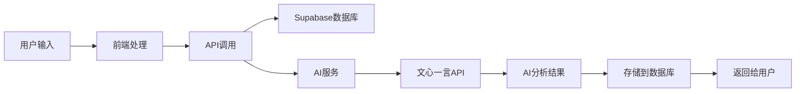

# 🧠 灵愈AI - 智能心理检测与疗愈助手

<div align="center">

[](https://reactjs.org/)
[](https://www.typescriptlang.org/)
[](https://vitejs.dev/)
[](https://supabase.com/)
[](https://tailwindcss.com/)

**🌟 基于多模态AI的数字医生抑郁检测与疗愈助手**

[在线体验](https://www.miaoda.cn/projects/app-97zabxvzebcx) • [功能演示](#-核心功能模块) • [快速开始](#-快速开始) • [API文档](#-api-接口)

</div>

---

## 📋 项目简介

灵愈AI是一款集**情绪记录**、**AI评估**、**冥想疗愈**、**社区互助**于一体的智能心理健康应用。采用现代化的医疗主题设计，结合文心一言多模态大模型，为用户提供专业、温暖的心理健康服务。

### ✨ 核心亮点

- 🤖 **多模态AI评估** - 支持文本、语音、图片、视频输入的智能心理评估
- 📝 **智能情绪日记** - 语音识别、图片上传、日历集成的全功能记录系统
- 🧘 **沉浸式冥想** - 3D呼吸动画、音频播放器、冥想统计追踪
- 👥 **匿名社区** - 安全的情感支持和经验分享平台
- 👨‍⚕️ **医生后台** - 专业的患者管理和风险预警系统
- 🎨 **医疗级UI** - 专业可信的医疗蓝主题设计

---

## 🛠️ 技术栈

### 前端技术
| 技术 | 版本 | 用途 |
|------|------|------|
| **React** | 18.3.1 | 现代化UI框架 |
| **TypeScript** | 5.9.3 | 类型安全开发 |
| **Vite** | 5.1.4 | 高性能构建工具 |
| **Tailwind CSS** | 3.4.11 | 原子化CSS框架 |
| **shadcn/ui** | latest | 高质量组件库 |
| **Lucide React** | 0.553.0 | 现代图标库 |
| **React Router** | 6.28.0 | 客户端路由 |
| **React Hook Form** | 7.66.0 | 高性能表单库 |
| **Motion** | 12.23.25 | 流畅动画效果 |

### 后端服务
| 服务 | 版本 | 用途 |
|------|------|------|
| **Supabase** | 2.76.1 | 后端即服务(BaaS) |
| **PostgreSQL** | 15+ | 关系型数据库 |
| **Edge Functions** | latest | 无服务器函数 |
| **Supabase Auth** | latest | 用户认证系统 |
| **Supabase Storage** | latest | 文件存储服务 |

### AI集成
| 服务 | 用途 |
|------|------|
| **文心一言多模态大模型** | 图片情绪分析、视频表情识别 |
| **文心文本生成大模型** | 智能对话、情绪分析 |
| **短语音识别API** | 语音转文字 |
| **RAG检索增强** | 知识库问答 |

### 开发工具
| 工具 | 版本 | 用途 |
|------|------|------|
| **Biome** | 2.3.4 | 代码检查和格式化 |
| **Sentry** | latest | 错误监控 |
| **html2canvas** | 1.4.1 | 截图功能 |
| **jsPDF** | 4.0.0 | PDF生成 |

---

## 🏗️ 项目架构

### 分层架构设计
```
┌─────────────────────────────────────┐
│      UI层 (React Components)        │
│  Pages + Components + Layouts       │
├─────────────────────────────────────┤
│      业务逻辑层 (Hooks + Context)   │
│  useAuth, useDebounce, useToast     │
├─────────────────────────────────────┤
│      数据访问层 (API Services)      │
│  src/db/api.ts (Supabase调用)       │
├─────────────────────────────────────┤
│      后端服务层 (Edge Functions)    │
│  text-chat, multimodal-chat, etc    │
├─────────────────────────────────────┤
│      数据库层 (Supabase)            │
│  PostgreSQL + Auth + Storage        │
└─────────────────────────────────────┘
```

### 路由结构
```
用户端路由:
├── / (首页) - 欢迎卡片、情绪评分、快捷入口
├── /record (记录) - 情绪日记、语音记录、图片上传
├── /assessment (评估) - 多模态AI评估、流式对话
├── /healing (疗愈) - 冥想播放器、知识库、社区
└── /profile (个人) - 个人资料、健康评分、设置

医生端路由:
├── /doctor/dashboard (数据看板) - 患者统计、风险预警
├── /doctor/patients (患者管理) - 患者列表、病历查看
├── /doctor/knowledge (知识库) - 医学知识、诊疗指南
└── /doctor/alerts (预警消息) - 风险预警、处理记录
```

---

## 📁 目录结构

```
miaoda-react-admin/
├── 📄 README.md                    # 项目说明文档
├── 📄 package.json                 # 依赖配置
├── 📄 vite.config.ts              # Vite构建配置
├── 📄 tailwind.config.js          # Tailwind样式配置
├── 📄 tsconfig.json               # TypeScript配置
├── 📄 components.json             # shadcn/ui组件配置
├── 📄 .env                        # 环境变量
├── 📁 public/                     # 静态资源
│   ├── 🖼️ favicon.png             # 应用图标
│   └── 📁 images/                 # 图片资源
├── 📁 src/                        # 源代码目录
│   ├── 📄 App.tsx                 # 应用入口组件
│   ├── 📄 main.tsx                # 应用启动文件
│   ├── 📄 routes.tsx              # 路由配置
│   ├── 📄 index.css               # 全局样式
│   ├── 📁 components/             # 组件库
│   │   ├── 📁 ui/                 # 基础UI组件
│   │   ├── 📁 common/             # 通用组件
│   │   ├── 📁 layouts/            # 布局组件
│   │   ├── 📁 record/             # 记录相关组件
│   │   ├── 📁 assessment/         # 评估相关组件
│   │   ├── 📁 healing/            # 疗愈相关组件
│   │   └── 📁 doctor/             # 医生端组件
│   ├── 📁 pages/                  # 页面组件
│   │   ├── 📄 HomePage.tsx        # 首页
│   │   ├── 📄 RecordPageNew.tsx   # 记录页
│   │   ├── 📄 EnhancedAssessmentPage.tsx # 评估页
│   │   ├── 📄 HealingPageNew.tsx  # 疗愈页
│   │   ├── 📄 ProfilePageRedesigned.tsx # 个人页
│   │   └── 📁 doctor/             # 医生端页面
│   ├── 📁 contexts/               # React Context
│   │   └── 📄 AuthContext.tsx     # 认证上下文
│   ├── 📁 hooks/                  # 自定义Hooks
│   ├── 📁 db/                     # 数据库相关
│   │   ├── 📄 supabase.ts         # Supabase客户端
│   │   └── 📄 api.ts              # API封装
│   ├── 📁 types/                  # TypeScript类型定义
│   │   ├── 📄 index.ts            # 导出类型
│   │   └── 📄 types.ts            # 核心类型
│   ├── 📁 lib/                    # 工具库
│   └── 📁 utils/                  # 工具函数
├── 📁 doc/                        # 项目文档
│   ├── 📄 DESIGN_SYSTEM.md        # 设计系统规范
│   ├── 📄 QUICK_NOTE_ENHANCED_FEATURES.md # 随手记功能文档
│   ├── 📄 MULTIMODAL_ASSESSMENT.md # 多模态评估文档
│   ├── 📄 HEALING_CENTER_FEATURES.md # 疗愈中心文档
│   └── 📄 MEDICAL_THEME_DESIGN.md # 医疗主题设计
├── 📁 supabase/                   # Supabase配置
└── 📁 .rules/                     # 代码检查规则
```

---

## ⚡ 核心功能模块

### 🏠 首页模块
- **动态问候** - 根据时间显示早安/下午好/晚上好
- **情绪评分** - SVG圆形进度条显示当前情绪状态
- **连续打卡** - 统计用户连续使用天数
- **快捷入口** - 2x2网格布局的功能入口
- **健康提示** - 个性化的每日健康建议
- **评估记录** - 最近的心理评估历史

### 📝 记录模块 (随手记)
- **多模态输入**
  - 📝 文本输入 - 大尺寸输入框，支持长文本
  - 🎤 语音输入 - 一键录音，自动语音识别转文字
  - 📷 图片上传 - 支持相册选择和直接拍照
- **日历集成**
  - 📅 中文本地化日历视图
  - 🏷️ 有记录日期的视觉标记(绿色边框+📝图标)
  - 💬 点击日期弹出详情卡片
- **记录管理**
  - ✏️ 在线编辑功能
  - 🗑️ 安全删除操作
  - 🖼️ 图片预览和管理

### 🧠 评估模块 (多模态AI)
- **智能对话** - 基于文心一言的流式AI对话
- **多模态输入**
  - 📝 文本输入 - 智能情绪分析
  - 🎤 语音识别 - webm→wav转换，语音转文字
  - 📷 图片分析 - 多模态大模型情绪识别
  - 📹 摄像头表情识别 - 实时面部表情分析
- **评估报告** - 风险等级评估和专业建议
- **历史追踪** - 评估记录和趋势分析

### 🧘 疗愈模块
#### 冥想Tab
- **音频播放器** - 支持播放/暂停、进度控制
- **3D呼吸动画** - 3层同心圆脉冲发光效果
- **冥想库** - 按分类浏览(呼吸/放松/睡眠/缓解/专注)
- **统计追踪** - 练习时长、天数、平均评分
- **情绪记录** - 冥想前后情绪对比

#### 知识Tab
- **智能搜索** - 多字段实时搜索
- **类型筛选** - 文章/视频/音频分类
- **内容展示** - 卡片式布局，支持收藏和点赞
- **Tab切换** - 推荐/热门/最新内容

#### 社区Tab
- **匿名发布** - 自动生成匿名昵称保护隐私
- **分类系统** - 寻求支持/分享进展/提问/提供鼓励/康复故事
- **康复故事** - 特殊金色高亮显示
- **互动功能** - 点赞、评论、分享

### 👤 个人模块
- **个人信息卡** - 渐变背景，大头像展示
- **健康评分** - 玻璃拟态效果的评分卡片
- **快捷功能** - 5个功能卡片(评估历史/健康档案/手环连接/医生对接/设置)
- **资料编辑** - 弹窗式编辑界面
- **账户管理** - 安全退出登录

### 👨‍⚕️ 医生后台
- **数据看板** - 患者统计、风险预警、趋势分析
- **患者管理** - 患者列表、详情查看、病历管理
- **知识库** - 医学知识、诊疗指南、案例库
- **预警系统** - 风险预警、处理记录、患者跟进

---

## 🔄 工作流程

### 用户使用流程
```mermaid
graph TD
    A[用户注册/登录] --> B[首页概览]
    B --> C{选择功能}
    C -->|记录情绪| D[随手记]
    C -->|AI评估| E[多模态评估]
    C -->|心理疗愈| F[冥想/知识/社区]
    C -->|个人中心| G[资料管理]
    
    D --> D1[文本/语音/图片输入]
    D1 --> D2[保存到日历]
    D2 --> D3[查看历史记录]
    
    E --> E1[选择输入方式]
    E1 --> E2[AI分析处理]
    E2 --> E3[生成评估报告]
    E3 --> E4[风险预警(如需要)]
    
    F --> F1{选择Tab}
    F1 -->|冥想| F2[播放音频+呼吸动画]
    F1 -->|知识| F3[浏览学习内容]
    F1 -->|社区| F4[匿名互助交流]
```

### 数据流程


---

## 🚀 快速开始

### 环境要求
- **Node.js** ≥ 20.0.0
- **npm** ≥ 10.0.0
- **现代浏览器** (Chrome 53+, Edge 79+, Safari 11+, Firefox 36+)

### 安装步骤

1. **克隆项目**
```bash
git clone <repository-url>
cd miaoda-react-admin
```

2. **安装依赖**
```bash
npm install
```

3. **环境配置**
```bash
# 复制环境变量模板
cp .env.example .env

# 编辑环境变量
nano .env
```

4. **环境变量配置**
```env
# Supabase配置
VITE_SUPABASE_URL=your_supabase_url
VITE_SUPABASE_ANON_KEY=your_supabase_anon_key

# 应用配置
VITE_APP_ID=app-97zabxvzebcx

# AI服务配置
INTEGRATIONS_API_KEY=your_ai_api_key
```

5. **启动开发服务器**
```bash
npm run dev
```

6. **访问应用**
```
本地开发: http://localhost:5173
```

### 构建部署

```bash
# 构建生产版本
npm run build

# 预览构建结果
npm run preview

# 代码检查
npm run lint
```

---

## ⚙️ 部署指南

### 前端部署

#### Vercel部署 (推荐)
```bash
# 安装Vercel CLI
npm i -g vercel

# 部署到Vercel
vercel --prod
```

#### Netlify部署
```bash
# 构建项目
npm run build

# 上传dist目录到Netlify
```

#### 自托管部署
```bash
# 构建项目
npm run build

# 将dist目录部署到Web服务器
# 配置nginx/apache支持SPA路由
```

### 后端配置

#### Supabase设置
1. **创建Supabase项目**
   - 访问 [supabase.com](https://supabase.com)
   - 创建新项目
   - 获取URL和API Key

2. **数据库初始化**
```sql
-- 创建用户档案表
CREATE TABLE profiles (
  id UUID REFERENCES auth.users ON DELETE CASCADE,
  username TEXT UNIQUE,
  email TEXT,
  phone TEXT,
  role TEXT DEFAULT 'user',
  avatar_url TEXT,
  full_name TEXT,
  gender TEXT,
  birth_date DATE,
  bio TEXT,
  created_at TIMESTAMP WITH TIME ZONE DEFAULT NOW(),
  updated_at TIMESTAMP WITH TIME ZONE DEFAULT NOW(),
  PRIMARY KEY (id)
);

-- 创建情绪日记表
CREATE TABLE emotion_diaries (
  id UUID DEFAULT gen_random_uuid() PRIMARY KEY,
  user_id UUID REFERENCES auth.users(id) ON DELETE CASCADE,
  diary_date DATE NOT NULL,
  emotion_level TEXT NOT NULL,
  title TEXT,
  content TEXT,
  tags TEXT[],
  image_urls TEXT[],
  voice_url TEXT,
  ai_analysis JSONB,
  created_at TIMESTAMP WITH TIME ZONE DEFAULT NOW(),
  updated_at TIMESTAMP WITH TIME ZONE DEFAULT NOW()
);

-- 更多表结构请参考数据库迁移文件
```

3. **存储桶配置**
```sql
-- 创建图片存储桶
INSERT INTO storage.buckets (id, name, public) VALUES ('diary-images', 'diary-images', true);

-- 设置存储策略
CREATE POLICY "用户可以上传图片" ON storage.objects FOR INSERT WITH CHECK (auth.uid()::text = (storage.foldername(name))[1]);
```

4. **Edge Functions部署**
```bash
# 安装Supabase CLI
npm install -g supabase

# 登录Supabase
supabase login

# 部署Edge Functions
supabase functions deploy text-chat
supabase functions deploy multimodal-chat
supabase functions deploy speech-recognition
```

### 环境变量配置

#### 生产环境
```env
# Supabase
VITE_SUPABASE_URL=https://your-project.supabase.co
VITE_SUPABASE_ANON_KEY=your-anon-key

# AI服务
INTEGRATIONS_API_KEY=your-ai-api-key

# 应用配置
VITE_APP_ID=app-97zabxvzebcx
NODE_ENV=production
```

#### 开发环境
```env
# 开发环境配置
NODE_ENV=development
VITE_DEV_MODE=true

# 本地Supabase (可选)
VITE_SUPABASE_URL=http://localhost:54321
VITE_SUPABASE_ANON_KEY=local-anon-key
```

---

## 📦 API 接口

### 认证接口

#### 用户注册
```typescript
POST /auth/signup
Content-Type: application/json

{
  "username": "string",
  "password": "string"
}

Response: {
  "user": User,
  "session": Session
}
```

#### 用户登录
```typescript
POST /auth/signin
Content-Type: application/json

{
  "username": "string", 
  "password": "string"
}

Response: {
  "user": User,
  "session": Session
}
```

### 用户档案接口

#### 获取用户档案
```typescript
GET /api/profiles/{userId}
Authorization: Bearer <token>

Response: {
  "id": "string",
  "username": "string",
  "email": "string",
  "full_name": "string",
  "role": "user" | "doctor" | "admin",
  "avatar_url": "string",
  "created_at": "string"
}
```

#### 更新用户档案
```typescript
PUT /api/profiles/{userId}
Authorization: Bearer <token>
Content-Type: application/json

{
  "full_name": "string",
  "phone": "string",
  "bio": "string"
}
```

### 情绪日记接口

#### 获取日记列表
```typescript
GET /api/emotion-diaries?user_id={userId}&limit={limit}
Authorization: Bearer <token>

Response: {
  "data": EmotionDiary[],
  "count": number
}
```

#### 创建日记
```typescript
POST /api/emotion-diaries
Authorization: Bearer <token>
Content-Type: application/json

{
  "diary_date": "2024-01-01",
  "emotion_level": "good",
  "content": "string",
  "image_urls": ["string"],
  "voice_url": "string"
}
```

#### 更新日记
```typescript
PUT /api/emotion-diaries/{id}
Authorization: Bearer <token>
Content-Type: application/json

{
  "content": "string",
  "emotion_level": "very_good"
}
```

#### 删除日记
```typescript
DELETE /api/emotion-diaries/{id}
Authorization: Bearer <token>
```

### AI评估接口

#### 文本对话
```typescript
POST /functions/v1/text-chat
Authorization: Bearer <token>
Content-Type: application/json

{
  "message": "string",
  "conversation_history": Array<{role: string, content: string}>
}

Response: Stream<{
  "content": "string",
  "done": boolean
}>
```

#### 多模态分析
```typescript
POST /functions/v1/multimodal-chat
Authorization: Bearer <token>
Content-Type: application/json

{
  "message": "string",
  "image_base64": "string",
  "conversation_history": Array
}

Response: Stream<{
  "content": "string", 
  "analysis": {
    "emotion": "string",
    "risk_level": number,
    "suggestions": string[]
  }
}>
```

#### 语音识别
```typescript
POST /functions/v1/speech-recognition
Authorization: Bearer <token>
Content-Type: application/json

{
  "format": "wav",
  "rate": 16000,
  "speech": "base64_audio_data",
  "len": number
}

Response: {
  "err_no": 0,
  "result": ["识别的文字内容"]
}
```

### 疗愈内容接口

#### 获取冥想内容
```typescript
GET /api/healing-contents?category={category}&content_type=meditation
Authorization: Bearer <token>

Response: {
  "data": HealingContent[],
  "count": number
}
```

#### 创建冥想记录
```typescript
POST /api/meditation-sessions
Authorization: Bearer <token>
Content-Type: application/json

{
  "content_id": "string",
  "duration": number,
  "completed": boolean,
  "mood_after": "string"
}
```

### 社区接口

#### 获取社区帖子
```typescript
GET /api/community-posts?category={category}&limit={limit}
Authorization: Bearer <token>

Response: {
  "data": CommunityPost[],
  "count": number
}
```

#### 发布帖子
```typescript
POST /api/community-posts
Authorization: Bearer <token>
Content-Type: application/json

{
  "title": "string",
  "content": "string", 
  "category_id": "string",
  "anonymous_nickname": "string"
}
```

#### 点赞帖子
```typescript
POST /api/community-posts/{postId}/like
Authorization: Bearer <token>

Response: {
  "liked": boolean,
  "like_count": number
}
```

### 医生端接口

#### 获取患者列表
```typescript
GET /api/doctor/patients
Authorization: Bearer <token>

Response: {
  "data": Patient[],
  "count": number
}
```

#### 获取风险预警
```typescript
GET /api/doctor/risk-alerts?status={status}
Authorization: Bearer <token>

Response: {
  "data": RiskAlert[],
  "count": number
}
```

#### 处理预警
```typescript
PUT /api/doctor/risk-alerts/{alertId}
Authorization: Bearer <token>
Content-Type: application/json

{
  "is_handled": true,
  "notes": "string"
}
```

### 错误响应格式

```typescript
// 4xx/5xx错误响应
{
  "error": {
    "code": "string",
    "message": "string",
    "details": "string"
  }
}

// 常见错误码
400 - Bad Request (请求参数错误)
401 - Unauthorized (未授权)
403 - Forbidden (权限不足)  
404 - Not Found (资源不存在)
429 - Too Many Requests (请求过于频繁)
500 - Internal Server Error (服务器内部错误)
```

---

## 💡 常见问题

### 🔧 开发相关

**Q: 如何解决npm install失败？**
```bash
# 清除缓存
npm cache clean --force

# 删除node_modules重新安装
rm -rf node_modules package-lock.json
npm install

# 使用cnpm镜像
npm install --registry=https://registry.npmmirror.com
```

**Q: 如何解决TypeScript类型错误？**
```bash
# 检查TypeScript配置
npx tsc --noEmit

# 更新类型定义
npm update @types/react @types/react-dom

# 重启TypeScript服务
# VS Code: Ctrl+Shift+P -> "TypeScript: Restart TS Server"
```

**Q: 如何解决Tailwind样式不生效？**
```bash
# 检查Tailwind配置
npx tailwindcss -i ./src/index.css -o ./dist/output.css --watch

# 确保content路径正确
# tailwind.config.js中的content数组包含所有组件文件
```

### 🗄️ 数据库相关

**Q: 如何重置Supabase数据库？**
```sql
-- 删除所有表数据(谨慎操作)
TRUNCATE TABLE emotion_diaries CASCADE;
TRUNCATE TABLE assessments CASCADE;
TRUNCATE TABLE community_posts CASCADE;

-- 重新运行迁移
-- 在Supabase Dashboard的SQL Editor中执行初始化脚本
```

**Q: 如何备份数据库？**
```bash
# 使用Supabase CLI
supabase db dump --file backup.sql

# 恢复数据库
supabase db reset --file backup.sql
```

**Q: 如何查看数据库日志？**
```bash
# 在Supabase Dashboard中查看
# Settings -> Logs -> Database Logs
```

### 🤖 AI服务相关

**Q: AI接口调用失败怎么办？**
```typescript
// 检查API密钥配置
console.log('API Key:', process.env.INTEGRATIONS_API_KEY);

// 检查网络连接
fetch('https://aip.baidubce.com/rpc/2.0/ai_custom/v1/wenxinworkshop/chat/completions')
  .then(response => console.log('Network OK'))
  .catch(error => console.error('Network Error:', error));

// 查看Edge Function日志
supabase functions logs text-chat
```

**Q: 语音识别不准确怎么办？**
```typescript
// 检查音频格式
const audioBlob = new Blob(audioChunks, { type: 'audio/webm' });
const wavBlob = await convertWebmToWav(audioBlob); // 确保转换为WAV

// 检查采样率设置
const mediaRecorder = new MediaRecorder(stream, { 
  mimeType: 'audio/webm',
  audioBitsPerSecond: 16000 
});
```

**Q: 图片分析失败怎么办？**
```typescript
// 检查图片大小和格式
if (file.size > 5 * 1024 * 1024) {
  throw new Error('图片大小不能超过5MB');
}

if (!file.type.startsWith('image/')) {
  throw new Error('只支持图片格式');
}

// 检查base64编码
const base64 = await imageToBase64(file);
console.log('Base64 length:', base64.length);
```

### 🎨 UI/UX相关

**Q: 如何自定义主题颜色？**
```css
/* 在src/index.css中修改CSS变量 */
:root {
  --primary: 214 100% 50%;        /* 主色调 */
  --secondary: 210 100% 96%;      /* 辅助色 */
  --success: 142 76% 36%;         /* 成功色 */
  --warning: 38 92% 50%;          /* 警告色 */
  --destructive: 0 84% 60%;       /* 错误色 */
}
```

**Q: 如何添加新的动画效果？**
```css
/* 在tailwind.config.js中添加自定义动画 */
module.exports = {
  theme: {
    extend: {
      keyframes: {
        'custom-bounce': {
          '0%, 100%': { transform: 'translateY(0)' },
          '50%': { transform: 'translateY(-10px)' }
        }
      },
      animation: {
        'custom-bounce': 'custom-bounce 1s ease-in-out infinite'
      }
    }
  }
}
```

**Q: 如何优化移动端体验？**
```css
/* 添加触摸友好的样式 */
.touch-friendly {
  min-height: 44px;  /* iOS推荐的最小触摸目标 */
  min-width: 44px;
}

/* 优化滚动体验 */
.smooth-scroll {
  -webkit-overflow-scrolling: touch;
  scroll-behavior: smooth;
}
```

### 🚀 部署相关

**Q: Vercel部署失败怎么办？**
```bash
# 检查构建日志
vercel logs

# 本地测试构建
npm run build
npm run preview

# 检查环境变量配置
vercel env ls
```

**Q: 如何配置自定义域名？**
```bash
# 在Vercel Dashboard中添加域名
# 配置DNS记录指向Vercel
# 等待SSL证书自动配置
```

**Q: 如何优化构建性能？**
```typescript
// vite.config.ts中配置代码分割
export default defineConfig({
  build: {
    rollupOptions: {
      output: {
        manualChunks: {
          vendor: ['react', 'react-dom'],
          ui: ['@radix-ui/react-dialog', '@radix-ui/react-button'],
          utils: ['date-fns', 'clsx']
        }
      }
    }
  }
});
```

### 📱 功能使用

**Q: 如何使用语音输入功能？**
1. 点击"语音输入"按钮
2. 允许浏览器访问麦克风权限
3. 开始说话(最长60秒)
4. 点击"停止录音"结束
5. 等待AI识别转换为文字

**Q: 如何上传图片？**
1. 点击"添加图片"按钮
2. 选择"从相册选择"或"拍照"
3. 选择图片文件(最大5MB)
4. 等待上传完成
5. 可以预览和删除已上传的图片

**Q: 如何使用AI评估功能？**
1. 进入评估页面
2. 选择输入方式(文字/语音/图片/摄像头)
3. 输入或上传内容
4. 等待AI分析处理
5. 查看评估报告和建议

**Q: 如何参与社区讨论？**
1. 进入疗愈页面的社区Tab
2. 选择帖子分类
3. 输入标题和内容(最多500字)
4. 点击发布(自动生成匿名昵称)
5. 可以点赞和评论其他用户的帖子

### 🔒 安全相关

**Q: 如何保护用户隐私？**
- 社区功能采用匿名机制
- 敏感数据加密存储
- 定期清理过期数据
- 遵循GDPR数据保护规范

**Q: 如何防止数据泄露？**
- 使用Supabase RLS(行级安全)
- API接口权限验证
- 前端数据脱敏处理
- 定期安全审计

**Q: 如何处理用户举报？**
- 社区内容审核机制
- 用户举报处理流程
- 违规内容自动隐藏
- 管理员后台处理工具

---

## 📞 技术支持

### 🔗 相关链接
- **项目地址**: [https://www.miaoda.cn/projects/app-97zabxvzebcx](https://www.miaoda.cn/projects/app-97zabxvzebcx)
- **文档中心**: [doc/](./doc/)
- **设计规范**: [doc/DESIGN_SYSTEM.md](./doc/DESIGN_SYSTEM.md)
- **功能文档**: [doc/QUICK_NOTE_ENHANCED_FEATURES.md](./doc/QUICK_NOTE_ENHANCED_FEATURES.md)

### 📧 联系方式
- **技术支持**: support@miaoda.cn
- **产品反馈**: feedback@miaoda.cn
- **商务合作**: business@miaoda.cn

### 🤝 贡献指南
1. Fork项目到个人仓库
2. 创建功能分支 (`git checkout -b feature/AmazingFeature`)
3. 提交更改 (`git commit -m 'Add some AmazingFeature'`)
4. 推送到分支 (`git push origin feature/AmazingFeature`)
5. 创建Pull Request

### 📄 开源协议
本项目采用 MIT 协议 - 查看 [LICENSE](LICENSE) 文件了解详情

---

<div align="center">

**🌟 如果这个项目对你有帮助，请给我们一个Star！**

Made with ❤️ by 灵愈AI团队

© 2024 灵愈AI. All rights reserved.

</div>
