# 🧠 灵愈AI - 智能心理检测与疗愈助手

<div align="center">

[](https://reactjs.org/)
[](https://www.typescriptlang.org/)
[](https://vitejs.dev/)
[](https://supabase.com/)
[](https://tailwindcss.com/)
[](https://github.com)
[](LICENSE)

**🌟 基于多模态AI的数字医生抑郁检测与疗愈助手**

[在线体验](https://www.miaoda.cn/projects/app-97zabxvzebcx) • [功能演示](#-核心功能模块) • [快速开始](#-快速开始) • [API文档](#-api-接口) • [部署指南](#-部署指南)

</div>

---

## 📋 项目简介

灵愈AI是一款专业的心理健康管理平台，集成**情绪记录**、**多模态AI评估**、**冥想疗愈**、**社区互助**、**医生后台**于一体。采用现代化医疗主题设计，结合百度文心一言多模态大模型，为用户提供科学、专业、温暖的心理健康服务。

### ✨ 核心亮点

- 🤖 **多模态AI评估** - 支持文本、语音、图片、视频的智能心理状态分析
- 📝 **智能情绪日记** - 语音识别、图片上传、日历集成的全功能记录系统  
- 🧘 **沉浸式冥想体验** - 3D呼吸动画、专业音频、统计追踪
- 👥 **匿名安全社区** - 隐私保护的情感支持和康复经验分享
- 👨‍⚕️ **专业医生后台** - 患者管理、风险预警、数据分析系统
- 🎨 **医疗级UI设计** - 专业可信的医疗蓝主题，符合医疗行业标准
- 🔒 **隐私安全保障** - 端到端加密，符合医疗数据安全规范
- 📊 **数据可视化** - 情绪趋势、健康评分、康复进度可视化展示

### 🏆 技术特色

- **现代化架构** - React 18 + TypeScript + Vite 构建的高性能SPA
- **响应式设计** - 完美适配桌面端、平板、手机等多种设备
- **实时通信** - 基于Supabase实时数据库的即时消息和状态同步
- **AI集成** - 深度集成百度文心一言，支持多模态内容理解
- **PWA支持** - 支持离线使用和桌面安装
- **国际化** - 支持多语言切换(中文/英文)
- **无障碍访问** - 遵循WCAG 2.1标准，支持屏幕阅读器

---

## 🛠️ 技术栈

### 前端技术
| 技术 | 版本 | 用途 | 特性 |
|------|------|------|------|
| **React** | 18.3.1 | 现代化UI框架 | Hooks、Concurrent Features |
| **TypeScript** | 5.9.3 | 类型安全开发 | 严格类型检查、智能提示 |
| **Vite** | 5.4.21 | 高性能构建工具 | HMR、ESM、插件生态 |
| **Tailwind CSS** | 3.4.11 | 原子化CSS框架 | JIT编译、响应式设计 |
| **Radix UI** | latest | 无障碍组件库 | WAI-ARIA、键盘导航 |
| **Lucide React** | 0.553.0 | 现代图标库 | 1000+图标、可定制 |
| **React Router** | 6.28.0 | 客户端路由 | 嵌套路由、懒加载 |
| **React Hook Form** | 7.66.0 | 高性能表单库 | 最小重渲染、验证 |
| **Framer Motion** | 12.23.25 | 流畅动画效果 | 手势、布局动画 |
| **date-fns** | 3.6.0 | 日期处理库 | 轻量级、函数式 |

### 后端服务
| 服务 | 版本 | 用途 | 特性 |
|------|------|------|------|
| **Supabase** | 2.76.1 | 后端即服务(BaaS) | 实时数据库、认证、存储 |
| **PostgreSQL** | 15+ | 关系型数据库 | ACID事务、JSON支持 |
| **Edge Functions** | latest | 无服务器函数 | Deno运行时、全球部署 |
| **Supabase Auth** | latest | 用户认证系统 | JWT、OAuth、MFA |
| **Supabase Storage** | latest | 文件存储服务 | CDN、图片处理 |
| **Row Level Security** | latest | 数据安全 | 细粒度权限控制 |

### AI集成
| 服务 | 用途 | 特性 |
|------|------|------|
| **百度文心一言4.0** | 文本对话、情绪分析 | 中文优化、上下文理解 |
| **文心多模态大模型** | 图片情绪识别、视频分析 | 表情识别、场景理解 |
| **百度短语音识别** | 语音转文字 | 实时识别、方言支持 |
| **RAG检索增强** | 知识库问答 | 向量搜索、语义匹配 |

### 开发工具
| 工具 | 版本 | 用途 | 特性 |
|------|------|------|------|
| **Biome** | 2.3.4 | 代码检查和格式化 | 快速、统一配置 |
| **html2canvas** | 1.4.1 | 截图功能 | DOM转图片 |
| **jsPDF** | 4.0.0 | PDF生成 | 客户端PDF |
| **QRCode** | 1.5.4 | 二维码生成 | 分享、下载 |

---

## 🏗️ 项目架构

### 分层架构设计
```
┌─────────────────────────────────────┐
│      展示层 (Presentation Layer)     │
│  React Components + Pages + Layouts │
├─────────────────────────────────────┤
│      业务逻辑层 (Business Layer)    │
│  Custom Hooks + Context + Services  │
├─────────────────────────────────────┤
│      数据访问层 (Data Access Layer) │
│  API Services + Supabase Client     │
├─────────────────────────────────────┤
│      服务层 (Service Layer)         │
│  Edge Functions + AI Integration    │
├─────────────────────────────────────┤
│      数据层 (Data Layer)            │
│  PostgreSQL + Storage + Auth        │
└─────────────────────────────────────┘
```

### 核心模块架构
```
MindCareAI/
├── 🎨 UI层
│   ├── components/ui/          # 基础UI组件(Radix UI)
│   ├── components/common/      # 通用业务组件
│   ├── components/layouts/     # 布局组件
│   └── pages/                  # 页面组件
├── 🧠 业务逻辑层
│   ├── hooks/                  # 自定义Hooks
│   ├── contexts/               # React Context
│   └── services/               # 业务服务
├── 🔌 数据访问层
│   ├── db/api.ts              # API封装
│   ├── db/supabase.ts         # Supabase客户端
│   └── types/                  # TypeScript类型
├── ⚡ 服务层
│   └── supabase/functions/     # Edge Functions
└── 🗄️ 数据层
    └── supabase/migrations/    # 数据库迁移
```

### 路由架构
```
用户端路由 (User Routes):
├── / (首页)                    # 欢迎页面、健康概览
├── /record (记录)              # 情绪日记、多媒体记录
├── /assessment (评估)          # AI多模态评估
├── /healing (疗愈)             # 冥想、知识、社区
├── /profile (个人)             # 个人资料、设置
└── /profile/* (子页面)         # 详细设置页面

医生端路由 (Doctor Routes):
├── /doctor/dashboard (看板)    # 数据统计、概览
├── /doctor/patients (患者)     # 患者管理、病历
├── /doctor/knowledge (知识)    # 医学知识库
└── /doctor/alerts (预警)       # 风险预警、处理

认证路由 (Auth Routes):
└── /login (登录)               # 用户登录、注册
```

### 数据流架构

```mermaid
graph TB
    A[用户交互] --> B[React组件]
    B --> C[Custom Hooks]
    C --> D[API Services]
    D --> E[Supabase Client]
    E --> F[Edge Functions]
    F --> G[AI Services]
    F --> H[PostgreSQL]
    G --> I[百度AI API]
    H --> J[实时订阅]
    J --> K[状态更新]
    K --> B
```


---

## 📁 目录结构

```
MindCareAI/
├── 📄 README.md                    # 项目说明文档
├── 📄 package.json                 # 项目依赖配置
├── 📄 vite.config.ts              # Vite构建配置
├── 📄 tailwind.config.js          # Tailwind样式配置
├── 📄 tsconfig.json               # TypeScript配置
├── 📄 components.json             # Radix UI组件配置
├── 📄 biome.json                  # 代码检查配置
├── 📄 .env                        # 环境变量配置
├── 📁 public/                     # 静态资源目录
│   ├── 🖼️ favicon.png             # 应用图标
│   ├── 📁 images/                 # 图片资源
│   └── 📄 manifest.json           # PWA配置
├── 📁 src/                        # 源代码目录
│   ├── 📄 App.tsx                 # 应用根组件
│   ├── 📄 main.tsx                # 应用入口文件
│   ├── 📄 routes.tsx              # 路由配置
│   ├── 📄 index.css               # 全局样式
│   ├── 📁 components/             # 组件库
│   │   ├── 📁 ui/                 # 基础UI组件(Radix UI)
│   │   │   ├── 📄 button.tsx      # 按钮组件
│   │   │   ├── 📄 card.tsx        # 卡片组件
│   │   │   ├── 📄 dialog.tsx      # 对话框组件
│   │   │   └── 📄 ...             # 其他UI组件
│   │   ├── 📁 common/             # 通用组件
│   │   │   ├── 📄 Header.tsx      # 页面头部
│   │   │   ├── 📄 Footer.tsx      # 页面底部
│   │   │   └── 📄 Loading.tsx     # 加载组件
│   │   ├── 📁 layouts/            # 布局组件
│   │   │   ├── 📄 MainLayout.tsx  # 主布局
│   │   │   └── 📄 AuthLayout.tsx  # 认证布局
│   │   ├── 📁 record/             # 记录相关组件
│   │   │   ├── 📄 EmotionPicker.tsx # 情绪选择器
│   │   │   ├── 📄 VoiceRecorder.tsx # 语音录制
│   │   │   └── 📄 ImageUploader.tsx # 图片上传
│   │   ├── 📁 assessment/         # 评估相关组件
│   │   │   ├── 📄 ChatInterface.tsx # 对话界面
│   │   │   ├── 📄 MultimodalInput.tsx # 多模态输入
│   │   │   └── 📄 AssessmentReport.tsx # 评估报告
│   │   ├── 📁 healing/            # 疗愈相关组件
│   │   │   ├── 📄 MeditationPlayer.tsx # 冥想播放器
│   │   │   ├── 📄 KnowledgeTab.tsx # 知识页签
│   │   │   └── 📄 CommunityTab.tsx # 社区页签
│   │   ├── 📁 profile/            # 个人页面组件
│   │   │   ├── 📄 ProfileCard.tsx # 个人信息卡
│   │   │   └── 📄 HealthScore.tsx # 健康评分
│   │   └── 📁 home/               # 首页组件
│   │       ├── 📄 WelcomeCard.tsx # 欢迎卡片
│   │       └── 📄 QuickActions.tsx # 快捷操作
│   ├── 📁 pages/                  # 页面组件
│   │   ├── 📄 HomePage.tsx        # 首页
│   │   ├── 📄 RecordPageNew.tsx   # 记录页面
│   │   ├── 📄 EnhancedAssessmentPage.tsx # 评估页面
│   │   ├── 📄 HealingPageNew.tsx  # 疗愈页面
│   │   ├── 📄 ProfilePageRedesigned.tsx # 个人页面
│   │   ├── 📄 LoginPage.tsx       # 登录页面
│   │   └── 📁 doctor/             # 医生端页面
│   │       ├── 📄 DashboardPage.tsx # 数据看板
│   │       ├── 📄 PatientsPage.tsx # 患者管理
│   │       ├── 📄 KnowledgePage.tsx # 知识库
│   │       └── 📄 AlertsPage.tsx  # 预警消息
│   ├── 📁 contexts/               # React Context
│   │   └── 📄 AuthContext.tsx     # 认证上下文
│   ├── 📁 hooks/                  # 自定义Hooks
│   │   ├── 📄 use-auth.ts         # 认证Hook
│   │   ├── 📄 use-debounce.ts     # 防抖Hook
│   │   ├── 📄 use-mobile.ts       # 移动端检测
│   │   └── 📄 use-toast.tsx       # 消息提示Hook
│   ├── 📁 db/                     # 数据库相关
│   │   ├── 📄 supabase.ts         # Supabase客户端
│   │   └── 📄 api.ts              # API封装函数
│   ├── 📁 types/                  # TypeScript类型定义
│   │   ├── 📄 index.ts            # 类型导出
│   │   └── 📄 types.ts            # 核心类型定义
│   ├── 📁 lib/                    # 工具库
│   │   └── 📄 utils.ts            # 通用工具函数
│   ├── 📁 utils/                  # 专用工具函数
│   │   ├── 📄 audio.ts            # 音频处理
│   │   └── 📄 sse.ts              # 服务端推送
│   └── 📁 services/               # 业务服务
│       └── 📄 .keep               # 占位文件
├── 📁 supabase/                   # Supabase配置
│   ├── 📄 config.toml             # Supabase配置
│   ├── 📁 functions/              # Edge Functions
│   │   ├── 📁 text-chat/          # 文本对话
│   │   ├── 📁 multimodal-chat/    # 多模态对话
│   │   ├── 📁 speech-recognition/ # 语音识别
│   │   ├── 📁 multimodal-analysis/ # 多模态分析
│   │   └── 📁 rag-retrieval/      # RAG检索
│   └── 📁 migrations/             # 数据库迁移
├── 📁 doc/                        # 项目文档
│   ├── 📄 DESIGN_SYSTEM.md        # 设计系统规范
│   ├── 📄 FEATURE_CHECKLIST.md    # 功能清单
│   ├── 📄 MULTIMODAL_ASSESSMENT.md # 多模态评估文档
│   ├── 📄 HEALING_CENTER_FEATURES.md # 疗愈中心文档
│   └── 📄 MEDICAL_THEME_DESIGN.md # 医疗主题设计
├── 📁 .rules/                     # 代码检查规则
│   ├── 📄 check.sh                # 检查脚本
│   ├── 📄 testBuild.sh            # 构建测试
│   └── 📄 *.yml                   # 规则配置
└── 📁 dist/                       # 构建输出目录
```

---

## ⚡ 核心功能模块

### 🏠 首页模块 (HomePage)
- **智能问候系统** - 根据时间和天气显示个性化问候
- **健康评分仪表盘** - SVG动画圆形进度条，实时显示心理健康状态
- **连续打卡统计** - 激励用户持续使用，建立健康习惯
- **快捷功能入口** - 2x2网格布局，一键访问核心功能
- **个性化建议** - 基于用户数据的每日健康提示
- **最近评估** - 展示最新的心理评估结果和趋势

### 📝 记录模块 (RecordPageNew)
- **多模态输入系统**
  - 📝 **富文本编辑** - 支持Markdown格式，表情符号
  - 🎤 **智能语音识别** - WebRTC录音，实时转文字，支持方言
  - 📷 **图片智能上传** - 拖拽上传，自动压缩，EXIF信息提取
  - 🎬 **视频录制** - 短视频记录，情绪表达更丰富
- **智能日历系统**
  - 📅 **中文本地化** - 农历显示，节假日标记
  - 🏷️ **情绪标记** - 不同颜色表示不同情绪状态
  - 💬 **快速预览** - 悬停显示当日记录摘要
  - 📊 **月度统计** - 情绪趋势图表，周期性分析
- **高级记录管理**
  - ✏️ **在线编辑** - 实时保存，版本历史
  - 🗑️ **安全删除** - 软删除机制，30天内可恢复
  - 🔍 **全文搜索** - 支持关键词、标签、日期范围搜索
  - 📤 **数据导出** - 支持PDF、Excel、JSON格式导出

### 🧠 评估模块 (EnhancedAssessmentPage)
- **多模态AI分析引擎**
  - 📝 **文本情绪分析** - NLP技术，识别情绪倾向和风险因子
  - 🎤 **语音情感识别** - 声纹分析，检测语调变化
  - 📷 **面部表情识别** - 实时检测微表情，情绪状态评估
  - 📹 **视频行为分析** - 肢体语言，行为模式识别
- **智能对话系统**
  - 🤖 **流式AI对话** - 基于文心一言4.0，自然语言交互
  - 🧠 **上下文记忆** - 多轮对话，个性化回应
  - 📋 **标准化量表** - PHQ-9、GAD-7等专业心理量表
  - 🎯 **自适应提问** - 根据回答动态调整问题
- **专业评估报告**
  - 📊 **风险等级评估** - 低、中、高风险分级
  - 💡 **个性化建议** - 基于评估结果的专业建议
  - 📈 **趋势分析** - 历史数据对比，康复进度追踪
  - 🚨 **风险预警** - 自动识别高风险状态，及时干预

### 🧘 疗愈模块 (HealingPageNew)

#### 冥想Tab - 沉浸式冥想体验
- **专业音频播放器**
  - 🎵 **高品质音频** - 支持多种格式，无损播放
  - ⏯️ **精确控制** - 播放、暂停、快进、倍速播放
  - 🔄 **循环模式** - 单曲循环、列表循环
  - 🎚️ **音效调节** - 均衡器、环境音混合
- **3D呼吸动画系统**
  - 🌊 **多层动画** - 3层同心圆，渐进式呼吸引导
  - ✨ **发光效果** - CSS动画，营造宁静氛围
  - 🎨 **主题切换** - 多种颜色主题，个性化体验
  - ⏱️ **节拍控制** - 可调节呼吸频率，适应不同需求
- **智能冥想库**
  - 🏷️ **分类管理** - 呼吸、放松、睡眠、专注、缓解压力
  - 🔍 **智能推荐** - 基于用户偏好和状态推荐内容
  - ⭐ **收藏系统** - 个人收藏夹，快速访问喜爱内容
  - 📊 **使用统计** - 练习时长、频率、效果追踪
- **冥想数据追踪**
  - ⏰ **时长统计** - 每日、每周、每月练习时长
  - 📅 **连续天数** - 连续练习天数，习惯养成
  - 🎯 **目标设定** - 个人冥想目标，进度追踪
  - 📈 **效果评估** - 冥想前后情绪对比

#### 知识Tab - 专业心理健康知识库
- **智能内容搜索**
  - 🔍 **多字段搜索** - 标题、内容、作者、标签全文搜索
  - 🏷️ **标签筛选** - 多级标签系统，精准定位
  - 📊 **搜索建议** - 智能补全，热门搜索推荐
- **内容分类系统**
  - 📖 **专业文章** - 心理学知识、自助指南
  - 🎬 **教学视频** - 专家讲座、技巧演示
  - 🎧 **音频课程** - 播客、冥想指导
  - 📚 **电子书籍** - 完整的心理健康书籍
- **个性化推荐**
  - 🎯 **智能推荐** - 基于阅读历史和兴趣推荐
  - 🔥 **热门内容** - 浏览量、点赞数排序
  - 🆕 **最新更新** - 时间排序，获取最新知识
  - ⭐ **专家精选** - 专业医生推荐的优质内容
- **互动功能**
  - 👍 **点赞收藏** - 表达喜好，建立个人知识库
  - 💬 **评论讨论** - 用户交流，知识分享
  - 📤 **内容分享** - 社交媒体分享，传播正能量
  - 📊 **学习进度** - 阅读进度，学习成就

#### 社区Tab - 匿名安全互助社区
- **隐私保护机制**
  - 🎭 **匿名发布** - 自动生成匿名昵称，保护真实身份
  - 🔒 **数据加密** - 端到端加密，确保隐私安全
  - 🛡️ **内容审核** - AI+人工双重审核，过滤有害内容
- **分类讨论系统**
  - 💬 **寻求支持** - 情感倾诉，获得理解和安慰
  - 📈 **分享进展** - 康复经历，激励他人
  - ❓ **疑问解答** - 专业问题，社区互助
  - 💪 **提供鼓励** - 正能量传递，相互支持
  - 🌟 **康复故事** - 成功案例，希望之光
- **康复故事特色**
  - 🏆 **特殊标识** - 金色高亮，突出展示
  - ✨ **精选推荐** - 编辑精选，优质内容
  - 📖 **完整叙述** - 详细的康复历程
  - 💡 **经验分享** - 实用的康复技巧
- **社区互动**
  - 👍 **点赞支持** - 表达认同，传递温暖
  - 💬 **深度评论** - 多层回复，深入交流
  - 🔄 **内容分享** - 传播正能量，扩大影响
  - 🚨 **举报机制** - 维护社区环境，及时处理问题

### 👤 个人模块 (ProfilePageRedesigned)
- **个人信息管理**
  - 👤 **头像系统** - 自定义头像，多种默认选项
  - 📝 **资料编辑** - 姓名、电话、生日等基本信息
  - 🔒 **隐私设置** - 数据可见性，隐私保护级别
  - 🎨 **主题定制** - 个性化界面主题
- **健康数据中心**
  - 📊 **健康评分** - 综合心理健康状态评分
  - 📈 **趋势分析** - 情绪变化趋势，康复进度
  - 📋 **评估历史** - 完整的评估记录和报告
  - 🏆 **成就系统** - 康复里程碑，激励机制
- **快捷功能中心**
  - 📊 **评估历史** - 查看所有心理评估记录
  - 📁 **健康档案** - 完整的健康数据管理
  - ⌚ **设备连接** - 智能手环、手表数据同步
  - 👨‍⚕️ **医生对接** - 专业医生咨询预约
  - ⚙️ **系统设置** - 通知、隐私、账户设置

### 👨‍⚕️ 医生后台系统
- **数据看板 (DashboardPage)**
  - 📊 **患者统计** - 总数、新增、活跃度统计
  - 🚨 **风险预警** - 高风险患者实时监控
  - 📈 **趋势分析** - 整体康复趋势，效果评估
  - 📋 **工作概览** - 今日任务，待处理事项
- **患者管理 (PatientsPage)**
  - 👥 **患者列表** - 完整的患者信息管理
  - 📋 **病历查看** - 详细的诊疗记录
  - 💬 **沟通记录** - 医患交流历史
  - 📊 **康复进度** - 可视化康复数据
- **知识库管理 (KnowledgePage)**
  - 📚 **医学知识** - 专业的心理学知识库
  - 📋 **诊疗指南** - 标准化诊疗流程
  - 📖 **案例库** - 典型病例和治疗方案
  - 🔄 **内容更新** - 最新研究成果和指南
- **预警系统 (AlertsPage)**
  - 🚨 **风险预警** - 自动识别高风险患者
  - 📝 **处理记录** - 预警处理过程记录
  - 👥 **患者跟进** - 后续治疗计划制定
  - 📊 **效果评估** - 干预效果统计分析

---

## 🔄 工作流程

### 用户使用流程
```mermaid
graph TD
    A[用户注册/登录] --> B[首页概览]
    B --> C{选择功能}
    C -->|记录情绪| D[随手记]
    C -->|AI评估| E[多模态评估]
    C -->|心理疗愈| F[冥想/知识/社区]
    C -->|个人中心| G[资料管理]
    
    D --> D1[文本/语音/图片输入]
    D1 --> D2[保存到日历]
    D2 --> D3[查看历史记录]
    
    E --> E1[选择输入方式]
    E1 --> E2[AI分析处理]
    E2 --> E3[生成评估报告]
    E3 --> E4[风险预警(如需要)]
    
    F --> F1{选择Tab}
    F1 -->|冥想| F2[播放音频+呼吸动画]
    F1 -->|知识| F3[浏览学习内容]
    F1 -->|社区| F4[匿名互助交流]
```

### 数据流程

```mermaid
graph LR
    A[用户输入] --> B[前端处理]
    B --> C[API调用]
    C --> D[Supabase数据库]
    C --> E[AI服务]
    E --> F[文心一言API]
    F --> G[AI分析结果]
    G --> H[存储到数据库]
    H --> I[返回给用户]
```


---

## 🚀 快速开始

### 📋 环境要求
- **Node.js** ≥ 20.0.0 (推荐使用LTS版本)
- **npm** ≥ 10.0.0 或 **pnpm** ≥ 8.0.0
- **现代浏览器** 
  - Chrome 88+ / Edge 88+ / Safari 14+ / Firefox 78+
  - 支持WebRTC、Web Audio API、Canvas API
- **开发环境**
  - VS Code (推荐) + 相关插件
  - Git 2.0+

### ⚡ 快速安装

#### 1. 克隆项目
```bash
# 使用HTTPS
git clone https://github.com/your-org/MindCareAI.git
cd MindCareAI

# 或使用SSH
git clone git@github.com:your-org/MindCareAI.git
cd MindCareAI
```

#### 2. 安装依赖
```bash
# 使用npm (推荐)
npm install

# 或使用pnpm (更快)
pnpm install

# 或使用yarn
yarn install
```

#### 3. 环境配置
```bash
# 复制环境变量模板
cp .env.example .env

# 编辑环境变量 (必须配置)
nano .env
```

#### 4. 环境变量配置
```env
# ===========================================
# Supabase 配置 (必须)
# ===========================================
VITE_SUPABASE_URL=your_supabase_project_url
VITE_SUPABASE_ANON_KEY=your_supabase_anon_key

# ===========================================
# 应用配置
# ===========================================
VITE_APP_ID=app-97zabxvzebcx
VITE_APP_NAME=灵愈AI
VITE_APP_VERSION=1.0.0

# ===========================================
# AI服务配置 (可选，用于AI功能)
# ===========================================
INTEGRATIONS_API_KEY=your_baidu_ai_api_key
VITE_AI_BASE_URL=https://aip.baidubce.com

# ===========================================
# 开发环境配置
# ===========================================
NODE_ENV=development
VITE_DEV_MODE=true
VITE_LOG_LEVEL=debug
```

#### 5. 启动开发服务器
```bash
# 启动开发服务器
npm run dev

# 服务器将在以下地址启动:
# ➜  Local:   http://localhost:5173/
# ➜  Network: http://192.168.1.100:5173/
```

#### 6. 访问应用
打开浏览器访问 `http://localhost:5173`

### 🔧 开发工具配置

#### VS Code 推荐插件
```json
{
  "recommendations": [
    "bradlc.vscode-tailwindcss",
    "esbenp.prettier-vscode", 
    "ms-vscode.vscode-typescript-next",
    "biomejs.biome",
    "ms-vscode.vscode-json"
  ]
}
```

#### VS Code 设置
```json
{
  "editor.formatOnSave": true,
  "editor.defaultFormatter": "biomejs.biome",
  "typescript.preferences.importModuleSpecifier": "relative",
  "tailwindCSS.experimental.classRegex": [
    ["cva\\(([^)]*)\\)", "[\"'`]([^\"'`]*).*?[\"'`]"],
    ["cx\\(([^)]*)\\)", "(?:'|\"|`)([^']*)(?:'|\"|`)"]
  ]
}
```

### 🏗️ 构建和部署

#### 本地构建
```bash
# 构建生产版本
npm run build

# 预览构建结果
npm run preview

# 构建输出在 dist/ 目录
```

#### 代码质量检查
```bash
# 运行所有检查 (推荐在提交前运行)
npm run lint

# 单独运行各项检查
npx biome check src/          # 代码格式和质量
npx tsc --noEmit             # TypeScript类型检查
.rules/check.sh              # 自定义规则检查
.rules/testBuild.sh          # 构建测试
```

#### 性能优化
```bash
# 分析构建包大小
npm run build -- --analyze

# 检查依赖更新
npm outdated

# 清理缓存
npm cache clean --force
rm -rf node_modules package-lock.json
npm install
```

---

## ⚙️ 部署指南

### 前端部署

#### Vercel部署 (推荐)
```bash
# 安装Vercel CLI
npm i -g vercel

# 部署到Vercel
vercel --prod
```

#### Netlify部署
```bash
# 构建项目
npm run build

# 上传dist目录到Netlify
```

#### 自托管部署
```bash
# 构建项目
npm run build

# 将dist目录部署到Web服务器
# 配置nginx/apache支持SPA路由
```

### 后端配置

#### Supabase设置
1. **创建Supabase项目**
   - 访问 [supabase.com](https://supabase.com)
   - 创建新项目
   - 获取URL和API Key

2. **数据库初始化**
```sql
-- 创建用户档案表
CREATE TABLE profiles (
  id UUID REFERENCES auth.users ON DELETE CASCADE,
  username TEXT UNIQUE,
  email TEXT,
  phone TEXT,
  role TEXT DEFAULT 'user',
  avatar_url TEXT,
  full_name TEXT,
  gender TEXT,
  birth_date DATE,
  bio TEXT,
  created_at TIMESTAMP WITH TIME ZONE DEFAULT NOW(),
  updated_at TIMESTAMP WITH TIME ZONE DEFAULT NOW(),
  PRIMARY KEY (id)
);

-- 创建情绪日记表
CREATE TABLE emotion_diaries (
  id UUID DEFAULT gen_random_uuid() PRIMARY KEY,
  user_id UUID REFERENCES auth.users(id) ON DELETE CASCADE,
  diary_date DATE NOT NULL,
  emotion_level TEXT NOT NULL,
  title TEXT,
  content TEXT,
  tags TEXT[],
  image_urls TEXT[],
  voice_url TEXT,
  ai_analysis JSONB,
  created_at TIMESTAMP WITH TIME ZONE DEFAULT NOW(),
  updated_at TIMESTAMP WITH TIME ZONE DEFAULT NOW()
);

-- 更多表结构请参考数据库迁移文件
```

3. **存储桶配置**
```sql
-- 创建图片存储桶
INSERT INTO storage.buckets (id, name, public) VALUES ('diary-images', 'diary-images', true);

-- 设置存储策略
CREATE POLICY "用户可以上传图片" ON storage.objects FOR INSERT WITH CHECK (auth.uid()::text = (storage.foldername(name))[1]);
```

4. **Edge Functions部署**
```bash
# 安装Supabase CLI
npm install -g supabase

# 登录Supabase
supabase login

# 部署Edge Functions
supabase functions deploy text-chat
supabase functions deploy multimodal-chat
supabase functions deploy speech-recognition
```

### 环境变量配置

#### 生产环境
```env
# Supabase
VITE_SUPABASE_URL=https://your-project.supabase.co
VITE_SUPABASE_ANON_KEY=your-anon-key

# AI服务
INTEGRATIONS_API_KEY=your-ai-api-key

# 应用配置
VITE_APP_ID=app-97zabxvzebcx
NODE_ENV=production
```

#### 开发环境
```env
# 开发环境配置
NODE_ENV=development
VITE_DEV_MODE=true

# 本地Supabase (可选)
VITE_SUPABASE_URL=http://localhost:54321
VITE_SUPABASE_ANON_KEY=local-anon-key
```

---

## 📦 API 接口

### 认证接口

#### 用户注册
```typescript
POST /auth/signup
Content-Type: application/json

{
  "username": "string",
  "password": "string"
}

Response: {
  "user": User,
  "session": Session
}
```

#### 用户登录
```typescript
POST /auth/signin
Content-Type: application/json

{
  "username": "string", 
  "password": "string"
}

Response: {
  "user": User,
  "session": Session
}
```

### 用户档案接口

#### 获取用户档案
```typescript
GET /api/profiles/{userId}
Authorization: Bearer <token>

Response: {
  "id": "string",
  "username": "string",
  "email": "string",
  "full_name": "string",
  "role": "user" | "doctor" | "admin",
  "avatar_url": "string",
  "created_at": "string"
}
```

#### 更新用户档案
```typescript
PUT /api/profiles/{userId}
Authorization: Bearer <token>
Content-Type: application/json

{
  "full_name": "string",
  "phone": "string",
  "bio": "string"
}
```

### 情绪日记接口

#### 获取日记列表
```typescript
GET /api/emotion-diaries?user_id={userId}&limit={limit}
Authorization: Bearer <token>

Response: {
  "data": EmotionDiary[],
  "count": number
}
```

#### 创建日记
```typescript
POST /api/emotion-diaries
Authorization: Bearer <token>
Content-Type: application/json

{
  "diary_date": "2024-01-01",
  "emotion_level": "good",
  "content": "string",
  "image_urls": ["string"],
  "voice_url": "string"
}
```

#### 更新日记
```typescript
PUT /api/emotion-diaries/{id}
Authorization: Bearer <token>
Content-Type: application/json

{
  "content": "string",
  "emotion_level": "very_good"
}
```

#### 删除日记
```typescript
DELETE /api/emotion-diaries/{id}
Authorization: Bearer <token>
```

### AI评估接口

#### 文本对话
```typescript
POST /functions/v1/text-chat
Authorization: Bearer <token>
Content-Type: application/json

{
  "message": "string",
  "conversation_history": Array<{role: string, content: string}>
}

Response: Stream<{
  "content": "string",
  "done": boolean
}>
```

#### 多模态分析
```typescript
POST /functions/v1/multimodal-chat
Authorization: Bearer <token>
Content-Type: application/json

{
  "message": "string",
  "image_base64": "string",
  "conversation_history": Array
}

Response: Stream<{
  "content": "string", 
  "analysis": {
    "emotion": "string",
    "risk_level": number,
    "suggestions": string[]
  }
}>
```

#### 语音识别
```typescript
POST /functions/v1/speech-recognition
Authorization: Bearer <token>
Content-Type: application/json

{
  "format": "wav",
  "rate": 16000,
  "speech": "base64_audio_data",
  "len": number
}

Response: {
  "err_no": 0,
  "result": ["识别的文字内容"]
}
```

### 疗愈内容接口

#### 获取冥想内容
```typescript
GET /api/healing-contents?category={category}&content_type=meditation
Authorization: Bearer <token>

Response: {
  "data": HealingContent[],
  "count": number
}
```

#### 创建冥想记录
```typescript
POST /api/meditation-sessions
Authorization: Bearer <token>
Content-Type: application/json

{
  "content_id": "string",
  "duration": number,
  "completed": boolean,
  "mood_after": "string"
}
```

### 社区接口

#### 获取社区帖子
```typescript
GET /api/community-posts?category={category}&limit={limit}
Authorization: Bearer <token>

Response: {
  "data": CommunityPost[],
  "count": number
}
```

#### 发布帖子
```typescript
POST /api/community-posts
Authorization: Bearer <token>
Content-Type: application/json

{
  "title": "string",
  "content": "string", 
  "category_id": "string",
  "anonymous_nickname": "string"
}
```

#### 点赞帖子
```typescript
POST /api/community-posts/{postId}/like
Authorization: Bearer <token>

Response: {
  "liked": boolean,
  "like_count": number
}
```

### 医生端接口

#### 获取患者列表
```typescript
GET /api/doctor/patients
Authorization: Bearer <token>

Response: {
  "data": Patient[],
  "count": number
}
```

#### 获取风险预警
```typescript
GET /api/doctor/risk-alerts?status={status}
Authorization: Bearer <token>

Response: {
  "data": RiskAlert[],
  "count": number
}
```

#### 处理预警
```typescript
PUT /api/doctor/risk-alerts/{alertId}
Authorization: Bearer <token>
Content-Type: application/json

{
  "is_handled": true,
  "notes": "string"
}
```

### 错误响应格式

```typescript
// 4xx/5xx错误响应
{
  "error": {
    "code": "string",
    "message": "string",
    "details": "string"
  }
}

// 常见错误码
400 - Bad Request (请求参数错误)
401 - Unauthorized (未授权)
403 - Forbidden (权限不足)  
404 - Not Found (资源不存在)
429 - Too Many Requests (请求过于频繁)
500 - Internal Server Error (服务器内部错误)
```

---

## 💡 常见问题与解决方案

### 🔧 开发环境问题

**Q: npm install 失败怎么办？**
```bash
# 方案1: 清除缓存重新安装
npm cache clean --force
rm -rf node_modules package-lock.json
npm install

# 方案2: 使用国内镜像
npm config set registry https://registry.npmmirror.com
npm install

# 方案3: 使用pnpm (推荐)
npm install -g pnpm
pnpm install
```

**Q: TypeScript 类型错误怎么解决？**
```bash
# 检查TypeScript配置
npx tsc --noEmit

# 更新类型定义
npm update @types/react @types/react-dom

# 重启TypeScript服务 (VS Code)
# Ctrl+Shift+P -> "TypeScript: Restart TS Server"

# 检查路径别名配置
# 确保 tsconfig.json 中的 paths 配置正确
```

**Q: Tailwind CSS 样式不生效？**
```bash
# 检查 tailwind.config.js 中的 content 配置
# 确保包含所有组件文件路径

# 重新构建CSS
npx tailwindcss -i ./src/index.css -o ./dist/output.css --watch

# 检查CSS导入
# 确保在 main.tsx 中导入了 index.css
```

**Q: Vite 开发服务器启动失败？**
```bash
# 检查端口占用
lsof -i :5173
kill -9 <PID>

# 使用其他端口
npm run dev -- --port 3000

# 清除Vite缓存
rm -rf node_modules/.vite
npm run dev
```

### 🗄️ 数据库相关问题

**Q: Supabase 连接失败？**
```typescript
// 检查环境变量配置
console.log('Supabase URL:', import.meta.env.VITE_SUPABASE_URL);
console.log('Supabase Key:', import.meta.env.VITE_SUPABASE_ANON_KEY);

// 检查网络连接
fetch(import.meta.env.VITE_SUPABASE_URL + '/rest/v1/')
  .then(response => console.log('Supabase连接正常'))
  .catch(error => console.error('Supabase连接失败:', error));
```

**Q: 数据库权限错误？**
```sql
-- 检查RLS策略
SELECT * FROM pg_policies WHERE tablename = 'your_table_name';

-- 临时禁用RLS (仅开发环境)
ALTER TABLE your_table_name DISABLE ROW LEVEL SECURITY;

-- 创建正确的RLS策略
CREATE POLICY "用户只能访问自己的数据" ON your_table_name
  FOR ALL USING (auth.uid() = user_id);
```

**Q: 如何重置数据库？**
```bash
# 使用Supabase CLI
supabase db reset

# 手动清理数据 (谨慎操作)
# 在Supabase Dashboard的SQL Editor中执行:
TRUNCATE TABLE emotion_diaries CASCADE;
TRUNCATE TABLE assessments CASCADE;
TRUNCATE TABLE community_posts CASCADE;
```

### 🤖 AI服务问题

**Q: AI接口调用失败？**
```typescript
// 检查API密钥
console.log('API Key存在:', !!process.env.INTEGRATIONS_API_KEY);

// 检查网络连接
const testAIConnection = async () => {
  try {
    const response = await fetch('/functions/v1/text-chat', {
      method: 'POST',
      headers: {
        'Authorization': `Bearer ${supabase.auth.session()?.access_token}`,
        'Content-Type': 'application/json'
      },
      body: JSON.stringify({ message: 'test' })
    });
    console.log('AI服务连接:', response.ok ? '正常' : '失败');
  } catch (error) {
    console.error('AI服务错误:', error);
  }
};
```

**Q: 语音识别不准确？**
```typescript
// 检查音频格式和质量
const checkAudioQuality = (audioBlob: Blob) => {
  console.log('音频大小:', audioBlob.size);
  console.log('音频类型:', audioBlob.type);
  
  // 确保转换为正确格式
  if (audioBlob.type !== 'audio/wav') {
    console.warn('建议使用WAV格式以获得更好的识别效果');
  }
};

// 优化录音设置
const mediaRecorder = new MediaRecorder(stream, {
  mimeType: 'audio/webm;codecs=opus',
  audioBitsPerSecond: 16000
});
```

**Q: 图片分析失败？**
```typescript
// 检查图片大小和格式
const validateImage = (file: File) => {
  const maxSize = 5 * 1024 * 1024; // 5MB
  const allowedTypes = ['image/jpeg', 'image/png', 'image/webp'];
  
  if (file.size > maxSize) {
    throw new Error('图片大小不能超过5MB');
  }
  
  if (!allowedTypes.includes(file.type)) {
    throw new Error('只支持JPEG、PNG、WebP格式');
  }
};

// 压缩图片
const compressImage = (file: File, quality = 0.8): Promise<Blob> => {
  return new Promise((resolve) => {
    const canvas = document.createElement('canvas');
    const ctx = canvas.getContext('2d')!;
    const img = new Image();
    
    img.onload = () => {
      canvas.width = img.width;
      canvas.height = img.height;
      ctx.drawImage(img, 0, 0);
      canvas.toBlob(resolve, 'image/jpeg', quality);
    };
    
    img.src = URL.createObjectURL(file);
  });
};
```

### 🎨 UI/UX 问题

**Q: 移动端适配问题？**
```css
/* 确保视口设置正确 */
/* 在 index.html 中 */
<meta name="viewport" content="width=device-width, initial-scale=1.0, maximum-scale=1.0, user-scalable=no">

/* 优化触摸体验 */
.touch-target {
  min-height: 44px;  /* iOS推荐最小触摸目标 */
  min-width: 44px;
}

/* 防止缩放 */
input, textarea {
  font-size: 16px; /* 防止iOS自动缩放 */
}

/* 优化滚动 */
.scroll-container {
  -webkit-overflow-scrolling: touch;
  overscroll-behavior: contain;
}
```

**Q: 深色模式适配？**
```typescript
// 检查系统主题偏好
const prefersDark = window.matchMedia('(prefers-color-scheme: dark)').matches;

// 监听主题变化
window.matchMedia('(prefers-color-scheme: dark)')
  .addEventListener('change', (e) => {
    if (e.matches) {
      document.documentElement.classList.add('dark');
    } else {
      document.documentElement.classList.remove('dark');
    }
  });
```

**Q: 动画性能优化？**
```css
/* 启用硬件加速 */
.animated-element {
  transform: translateZ(0);
  will-change: transform;
}

/* 优化重绘 */
.smooth-animation {
  transform: translate3d(0, 0, 0);
  backface-visibility: hidden;
}

/* 减少动画复杂度 */
@media (prefers-reduced-motion: reduce) {
  * {
    animation-duration: 0.01ms !important;
    animation-iteration-count: 1 !important;
    transition-duration: 0.01ms !important;
  }
}
```

### 🚀 部署相关问题

**Q: Vercel 部署失败？**
```bash
# 检查构建日志
vercel logs

# 本地测试构建
npm run build
npm run preview

# 检查环境变量
vercel env ls
vercel env add VITE_SUPABASE_URL production

# 检查vercel.json配置
{
  "buildCommand": "npm run build",
  "outputDirectory": "dist",
  "framework": "vite"
}
```

**Q: 静态资源404错误？**
```typescript
// 检查Vite配置中的base路径
// vite.config.ts
export default defineConfig({
  base: process.env.NODE_ENV === 'production' ? '/your-repo-name/' : '/',
  // ...
});

// 检查路由配置
// 确保使用HashRouter或配置服务器重写规则
```

**Q: 环境变量在生产环境不生效？**
```bash
# 确保环境变量以VITE_开头
VITE_SUPABASE_URL=xxx  # ✅ 正确
SUPABASE_URL=xxx       # ❌ 错误，不会被Vite处理

# 检查构建时的环境变量
npm run build -- --mode production

# 在Vercel中设置环境变量
# Dashboard -> Settings -> Environment Variables
```

### 🔒 安全相关问题

**Q: 如何保护API密钥？**
```typescript
// ❌ 错误：在前端暴露敏感密钥
const API_KEY = 'sk-xxx'; // 永远不要这样做

// ✅ 正确：使用Edge Functions
// 在supabase/functions中处理敏感操作
export default async function handler(req: Request) {
  const API_KEY = Deno.env.get('OPENAI_API_KEY'); // 服务端环境变量
  // 处理API调用
}
```

**Q: 如何防止XSS攻击？**
```typescript
// 使用DOMPurify清理用户输入
import DOMPurify from 'dompurify';

const sanitizeHTML = (html: string) => {
  return DOMPurify.sanitize(html);
};

// React中避免dangerouslySetInnerHTML
// 使用安全的文本渲染
<div>{userInput}</div> // ✅ 安全
<div dangerouslySetInnerHTML={{__html: userInput}} /> // ❌ 危险
```

**Q: 如何实现内容安全策略(CSP)？**
```html
<!-- 在index.html中添加CSP头 -->
<meta http-equiv="Content-Security-Policy" 
      content="default-src 'self'; 
               script-src 'self' 'unsafe-inline'; 
               style-src 'self' 'unsafe-inline'; 
               img-src 'self' data: https:; 
               connect-src 'self' https://your-supabase-url.supabase.co;">
```

### 📱 功能使用问题

**Q: 语音录制权限被拒绝？**
```typescript
const requestMicrophonePermission = async () => {
  try {
    const stream = await navigator.mediaDevices.getUserMedia({ audio: true });
    console.log('麦克风权限已获取');
    return stream;
  } catch (error) {
    if (error.name === 'NotAllowedError') {
      alert('请在浏览器设置中允许麦克风权限');
    } else if (error.name === 'NotFoundError') {
      alert('未检测到麦克风设备');
    }
    throw error;
  }
};
```

**Q: 图片上传失败？**
```typescript
const handleImageUpload = async (file: File) => {
  // 检查文件大小
  if (file.size > 10 * 1024 * 1024) {
    throw new Error('图片大小不能超过10MB');
  }
  
  // 检查文件类型
  if (!file.type.startsWith('image/')) {
    throw new Error('只能上传图片文件');
  }
  
  try {
    const { data, error } = await supabase.storage
      .from('images')
      .upload(`${Date.now()}-${file.name}`, file);
      
    if (error) throw error;
    return data;
  } catch (error) {
    console.error('上传失败:', error);
    throw new Error('图片上传失败，请重试');
  }
};
```

---

## 📞 技术支持与社区

### 🔗 相关链接
- **🌐 在线演示**: [https://www.miaoda.cn/projects/app-97zabxvzebcx](https://www.miaoda.cn/projects/app-97zabxvzebcx)
- **📚 完整文档**: [doc/](./doc/) 目录
- **🎨 设计规范**: [DESIGN_SYSTEM.md](./doc/DESIGN_SYSTEM.md)
- **✅ 功能清单**: [FEATURE_CHECKLIST.md](./doc/FEATURE_CHECKLIST.md)
- **🤖 AI评估文档**: [MULTIMODAL_ASSESSMENT.md](./doc/MULTIMODAL_ASSESSMENT.md)
- **🧘 疗愈功能**: [HEALING_CENTER_FEATURES.md](./doc/HEALING_CENTER_FEATURES.md)

### 📧 联系方式
- **💬 技术支持**: [support@miaoda.cn](mailto:support@miaoda.cn)
- **💡 产品反馈**: [feedback@miaoda.cn](mailto:feedback@miaoda.cn)  
- **🤝 商务合作**: [business@miaoda.cn](mailto:business@miaoda.cn)
- **🐛 Bug报告**: [GitHub Issues](https://github.com/your-org/MindCareAI/issues)

### 🤝 贡献指南

我们欢迎所有形式的贡献！请遵循以下步骤：

#### 代码贡献
1. **Fork项目** 到个人仓库
2. **创建功能分支** 
   ```bash
   git checkout -b feature/amazing-feature
   ```
3. **提交更改**
   ```bash
   git commit -m 'feat: add amazing feature'
   ```
4. **推送到分支**
   ```bash
   git push origin feature/amazing-feature
   ```
5. **创建Pull Request**

#### 提交规范
我们使用 [Conventional Commits](https://www.conventionalcommits.org/) 规范：

```bash
# 功能添加
git commit -m "feat: 添加语音识别功能"

# Bug修复  
git commit -m "fix: 修复登录状态检查问题"

# 文档更新
git commit -m "docs: 更新API文档"

# 样式调整
git commit -m "style: 优化移动端布局"

# 重构代码
git commit -m "refactor: 重构认证逻辑"

# 性能优化
git commit -m "perf: 优化图片加载性能"

# 测试相关
git commit -m "test: 添加单元测试"
```

#### 代码规范
- 使用 **TypeScript** 进行类型安全开发
- 遵循 **Biome** 代码格式化规范
- 组件使用 **PascalCase** 命名
- 函数使用 **camelCase** 命名
- 常量使用 **UPPER_SNAKE_CASE** 命名
- 添加适当的注释和文档

#### 测试要求
- 新功能必须包含相应的测试用例
- 确保所有测试通过
- 测试覆盖率不低于80%

### 🌟 贡献者

感谢所有为项目做出贡献的开发者：

<a href="https://github.com/your-org/MindCareAI/graphs/contributors">
  
</a>

### 📊 项目统计


### 🏆 致谢

特别感谢以下开源项目和服务：

- **[React](https://reactjs.org/)** - 强大的UI框架
- **[Supabase](https://supabase.com/)** - 优秀的后端服务
- **[Tailwind CSS](https://tailwindcss.com/)** - 高效的CSS框架
- **[Radix UI](https://www.radix-ui.com/)** - 无障碍组件库
- **[Lucide](https://lucide.dev/)** - 精美的图标库
- **[百度AI](https://ai.baidu.com/)** - 强大的AI能力支持

### 📄 开源协议

本项目采用 **MIT 协议** 开源 - 查看 [LICENSE](LICENSE) 文件了解详情

```
MIT License

Copyright (c) 2024 灵愈AI团队

Permission is hereby granted, free of charge, to any person obtaining a copy
of this software and associated documentation files (the "Software"), to deal
in the Software without restriction, including without limitation the rights
to use, copy, modify, merge, publish, distribute, sublicense, and/or sell
copies of the Software, and to permit persons to whom the Software is
furnished to do so, subject to the following conditions:

The above copyright notice and this permission notice shall be included in all
copies or substantial portions of the Software.

THE SOFTWARE IS PROVIDED "AS IS", WITHOUT WARRANTY OF ANY KIND, EXPRESS OR
IMPLIED, INCLUDING BUT NOT LIMITED TO THE WARRANTIES OF MERCHANTABILITY,
FITNESS FOR A PARTICULAR PURPOSE AND NONINFRINGEMENT. IN NO EVENT SHALL THE
AUTHORS OR COPYRIGHT HOLDERS BE LIABLE FOR ANY CLAIM, DAMAGES OR OTHER
LIABILITY, WHETHER IN AN ACTION OF CONTRACT, TORT OR OTHERWISE, ARISING FROM,
OUT OF OR IN CONNECTION WITH THE SOFTWARE OR THE USE OR OTHER DEALINGS IN THE
SOFTWARE.
```

### 🔮 未来规划

#### 近期计划 (Q1 2025)
- [ ] **PWA支持** - 离线使用和桌面安装
- [ ] **国际化** - 多语言支持(英文、日文)
- [ ] **智能手环集成** - 心率、睡眠数据同步
- [ ] **AI助手升级** - 更智能的对话和建议

#### 中期计划 (Q2-Q3 2025)  
- [ ] **视频通话** - 在线心理咨询功能
- [ ] **群组疗愈** - 多人冥想和讨论
- [ ] **数据分析** - 更深入的健康洞察
- [ ] **API开放** - 第三方集成支持

#### 长期愿景 (2025+)
- [ ] **VR/AR支持** - 沉浸式疗愈体验
- [ ] **AI医生** - 专业级AI诊断助手
- [ ] **生态系统** - 完整的心理健康平台
- [ ] **科研合作** - 与医疗机构深度合作

---

<div align="center">

**🌟 如果这个项目对你有帮助，请给我们一个Star！**

**让我们一起为心理健康事业贡献力量** 💪

Made with ❤️ by [灵愈AI团队](https://www.miaoda.cn)

© 2026 灵愈AI. All rights reserved.

---

*"科技向善，用AI温暖每一颗心"* ✨

</div>
