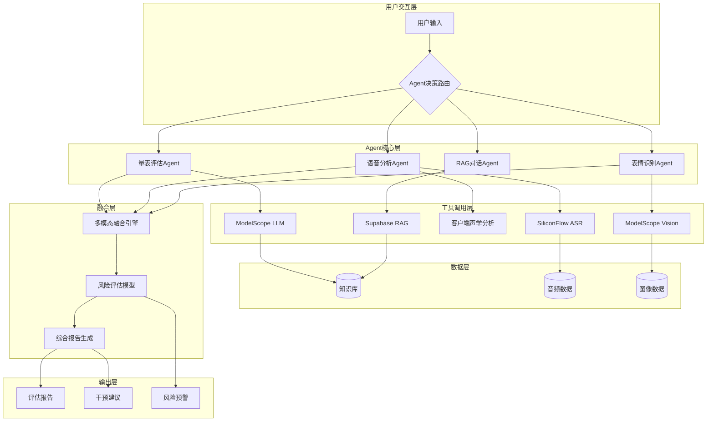
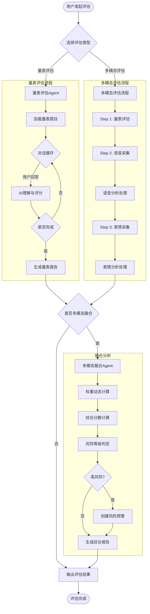
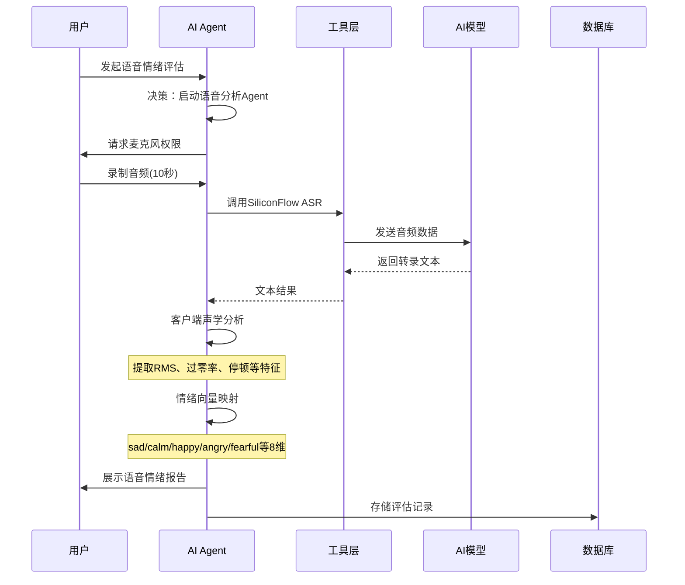
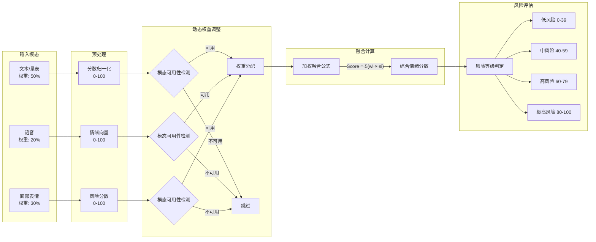
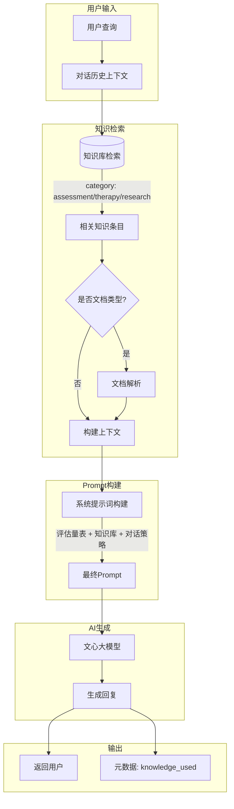
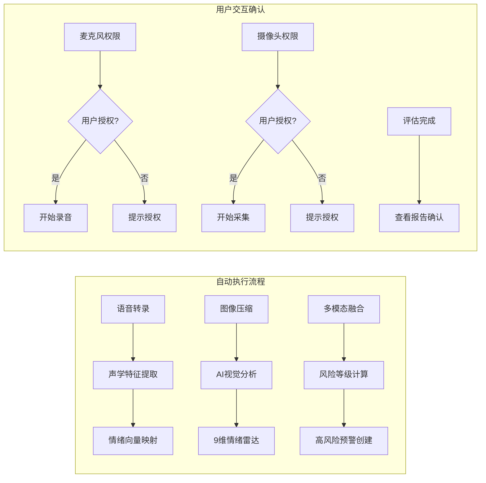

# MindCareAI 智能心理健康评估系统 - AI Agent 技术文档

## 目录
- [1. 系统概述](#1-系统概述)
- [2. AI Agent 整体架构](#2-ai-agent-整体架构)
- [3. 核心工作流程](#3-核心工作流程)
- [4. 多模态融合机制](#4-多模态融合机制)
- [5. RAG 检索增强生成](#5-rag-检索增强生成)
- [6. 外部工具与API调用](#6-外部工具与api调用)
- [7. 自动执行与用户交互](#7-自动执行与用户交互)
- [8. 技术实现细节](#8-技术实现细节)

---

## 1. 系统概述

MindCareAI 是一个基于多模态 AI 技术的智能心理健康评估系统。系统通过整合**量表评估**、**语音情绪识别**、**面部表情分析**三种模态数据，结合 RAG（检索增强生成）技术，为用户提供专业、精准的心理健康评估服务。

### 1.1 核心特性

- **多模态数据融合**：整合文本、语音、视觉三种模态的情绪分析
- **RAG 知识增强**：基于专业知识库的智能对话评估
- **实时分析能力**：支持流式响应和实时情绪检测
- **风险评估预警**：自动化高风险识别与预警机制

---

## 2. AI Agent 整体架构

### 2.1 系统架构图



### 2.2 Agent 类型与职责

| Agent 类型 | 功能描述 | 触发条件 |
|-----------|---------|---------|
| **量表评估 Agent** | PHQ-9/HAMD-17/SDS-20 标准化量表评估 | 用户选择量表评估模块 |
| **语音分析 Agent** | 语音转录、声学特征提取、情绪识别 | 用户录制或上传音频 |
| **表情识别 Agent** | 面部微表情捕捉、9维情绪雷达分析 | 用户开启摄像头 |
| **RAG 对话 Agent** | 知识库检索、上下文对话、评估引导 | 评估对话场景 |
| **融合分析 Agent** | 多模态数据加权融合、风险评估 | 完成多模态采集后 |

---

## 3. 核心工作流程

### 3.1 完整评估流程图



### 3.2 用户输入 → Agent决策 → 工具调用 → 执行结果



---

## 4. 多模态融合机制

### 4.1 融合架构



### 4.2 融合算法实现

系统采用**加权动态融合算法**，核心实现位于 [multimodal-fusion/index.ts](supabase/functions/multimodal-fusion/index.ts)：

```typescript
// 默认权重配置
const weights = {
  text: 0.4,    // 文本/量表分析
  image: 0.2,   // 图片分析
  voice: 0.2,   // 语音分析
  video: 0.2    // 视频分析
};

// 动态权重调整逻辑
const activeModalities = Object.values(scores).filter(s => s > 0).length;
if (activeModalities < 4) {
  const totalActiveWeight = Object.entries(scores)
    .filter(([_, score]) => score > 0)
    .reduce((sum, [key, _]) => sum + weights[key], 0);
  
  // 重新分配权重到有效模态
  Object.keys(adjustedWeights).forEach(key => {
    if (scores[key] > 0) {
      adjustedWeights[key] = weights[key] / totalActiveWeight;
    }
  });
}

// 综合情绪分数计算
const fusedScore = 
  scores.text * adjustedWeights.text +
  scores.image * adjustedWeights.image +
  scores.voice * adjustedWeights.voice +
  scores.video * adjustedWeights.video;
```

### 4.3 多维症状分析

融合引擎不仅计算综合分数，还进行多维度症状分析：

```typescript
const symptoms = {
  情绪低落: Math.round((scores.text * 0.5 + scores.video * 0.5) * 10) / 10,
  兴趣丧失: Math.round((scores.text * 0.6 + scores.voice * 0.4) * 10) / 10,
  睡眠障碍: Math.round((scores.text * 0.7 + scores.image * 0.3) * 10) / 10,
  精力下降: Math.round((scores.voice * 0.5 + scores.video * 0.5) * 10) / 10,
  自我评价低: Math.round((scores.text * 0.8 + scores.image * 0.2) * 10) / 10,
  注意力不集中: Math.round((scores.text * 0.5 + scores.voice * 0.5) * 10) / 10,
};
```

---

## 5. RAG 检索增强生成

### 5.1 RAG 工作流程



### 5.2 RAG 核心实现

RAG 实现位于 [rag-retrieval/index.ts](supabase/functions/rag-retrieval/index.ts)：

```typescript
// 1. 从知识库检索相关内容
const { data: knowledgeItems } = await supabase
  .from('knowledge_base')
  .select('*')
  .eq('is_active', true)
  .or(`category.eq.assessment,category.eq.therapy,category.eq.research,tags.cs.{${assessment_type}}`)
  .limit(5);

// 2. 文档类型解析
const enrichedItems = await Promise.all(
  knowledgeItems.map(async (item) => {
    if (item.content_type === 'document' && item.file_url) {
      const { data: fileData } = await supabase.storage
        .from('knowledge-documents')
        .download(item.file_url);
      // 解析文档内容...
      return { ...item, content: parsedContent };
    }
    return item;
  })
);

// 3. 构建RAG上下文
const knowledgeContext = enrichedItems
  .map(item => `【${item.title}】\n${item.content}`)
  .join('\n\n');

// 4. 主动式对话系统提示词
const systemPrompt = `你是一位专业的心理咨询师，正在进行抑郁症评估对话。

【评估量表】${assessment_type}
【知识库参考】${knowledgeContext}

【对话策略】
1. 主动式提问：根据评估量表的维度，逐步深入了解用户状态
2. 渐进式探索：从轻松话题开始，逐渐深入敏感问题
3. 共情回应：对用户的感受表示理解和关怀
4. 洞察分析：识别用户话语中的情绪信号和风险因素
5. 多维评估：涵盖情绪、睡眠、兴趣、精力、自我评价等维度

【当前对话轮次】${conversation_history.length / 2}
【下一步行动】${getDialoguePhase(conversation_history.length)}`;
```

### 5.3 对话阶段决策

```typescript
// 根据对话轮次动态调整策略
const getDialoguePhase = (historyLength: number): string => {
  if (historyLength === 0) 
    return '开场: 温和地介绍评估目的，询问用户最近的整体感受';
  if (historyLength < 6) 
    return '探索期: 根据用户回答，选择1-2个核心维度深入询问';
  if (historyLength < 12) 
    return '深入期: 关注用户提到的困扰，探索具体表现和影响';
  return '总结期: 整合信息，给予初步反馈，询问是否还有补充';
};
```

---

## 6. 外部工具与API调用

### 6.1 API 调用矩阵

| API 服务 | 用途 | 调用时机 | 文件位置 |
|---------|------|---------|---------|
| **ModelScope Chat** | AI对话、量表评估 | 量表评估对话 | [modelscope.ts](src/db/modelscope.ts) |
| **ModelScope Vision** | 图像理解、表情分析 | 表情识别阶段 | [modelscope.ts:184](src/db/modelscope.ts#L184) |
| **SiliconFlow ASR** | 语音转文字 | 语音分析阶段 | [siliconflow.ts](src/db/siliconflow.ts) |
| **火山引擎 ARK** | 文心大模型调用 | Edge Functions | [volc/responses.ts](api/volc/responses.ts) |
| **Supabase Functions** | 服务端AI处理 | 多模态融合、RAG检索 | [api.ts:727-792](src/db/api.ts#L727-L792) |

### 6.2 ModelScope 聊天补全

```typescript
// 文件: src/db/modelscope.ts
export async function modelScopeChatCompletion(
  payload: { messages: ModelScopeMessage[]; stream?: boolean }
) {
  const body = {
    model: 'MiniMax/MiniMax-M2.5',
    messages: payload.messages,
    stream: payload.stream ?? true,
    temperature: 0.7,
    max_tokens: 512,
  };

  // 流式响应支持打字机效果
  const response = await fetch('/innerapi/v1/modelscope/chat/completions', {
    method: 'POST',
    headers: { 'Content-Type': 'application/json' },
    body: JSON.stringify(body),
  });

  // SSE 流式解析...
}
```

### 6.3 SiliconFlow 语音识别

```typescript
// 文件: src/db/siliconflow.ts
export async function transcribeAudio(
  audioFile: File | Blob,
  model: 'TeleAI/TeleSpeechASR' | 'FunAudioLLM/SenseVoiceSmall' = 'TeleAI/TeleSpeechASR'
) {
  const formData = new FormData();
  formData.append('file', file);
  formData.append('model', model);

  const resp = await ky.post('/innerapi/v1/siliconflow/audio/transcriptions', {
    body: formData,
    timeout: 60000,
  });

  return { text: data?.text };
}
```

### 6.4 视觉理解（表情分析）

```typescript
// 文件: src/db/modelscope.ts
export async function modelScopeVisionChat(
  payload: { model: string; text: string; image_url: string }
) {
  const body = {
    model: 'Qwen/Qwen2-VL-7B-Instruct',
    messages: [{
      role: 'user',
      content: [
        { type: 'text', text: payload.text },
        { type: 'image_url', image_url: { url: payload.image_url } },
      ],
    }],
    temperature: 0,
    max_tokens: 200,
  };
  
  // 返回 JSON 格式的情绪分析结果
}
```

---

## 7. 自动执行与用户交互

### 7.1 流程分类



### 7.2 自动执行场景

| 场景 | 触发条件 | 自动操作 | 代码位置 |
|-----|---------|---------|---------|
| 语音转录完成 | 音频数据准备就绪 | 自动调用ASR | [VoiceStep.tsx:164-166](src/components/assessment/VoiceStep.tsx#L164-L166) |
| 声学分析 | 转录完成 | 客户端特征提取 | [VoiceStep.tsx:169-227](src/components/assessment/VoiceStep.tsx#L169-L227) |
| 表情分析 | 5秒采集完成 | 自动调用Vision AI | [ExpressionStep.tsx:253-316](src/components/assessment/ExpressionStep.tsx#L253-L316) |
| 融合计算 | 多模态数据就绪 | 自动加权融合 | [FusionReport.tsx:404-461](src/components/assessment/FusionReport.tsx#L404-L461) |
| 高风险预警 | 融合分数≥80 | 自动创建预警 | [FusionReport.tsx:463-485](src/components/assessment/FusionReport.tsx#L463-L485) |

### 7.3 需要用户确认的场景

| 场景 | 用户操作 | 系统响应 |
|-----|---------|---------|
| 开启麦克风 | 点击"开始录音"按钮 | 请求权限，开始采集 |
| 开启摄像头 | 点击"开始表情识别" | 请求权限，启动预览 |
| 上传音频 | 选择本地文件 | 直接分析 |
| 查看详细报告 | 点击报告卡片 | 弹出详细报告Dialog |
| 导出PDF/PNG | 点击导出按钮 | 生成并下载 |

---

## 8. 技术实现细节

### 8.1 语音情绪分析实现

语音分析采用**客户端声学特征提取 + AI转录**的双重分析策略：

```typescript
// 文件: src/components/assessment/VoiceStep.tsx

// 1. ASR 转录
const transcription = await transcribeAudio(blob);
const text = transcription.text;

// 2. 客户端声学分析
const audioCtx = new AudioContext();
const buffer = await audioCtx.decodeAudioData(arrayBuffer);
const channelData = buffer.getChannelData(0);

// 提取特征
let rmsSum = 0, pauses = 0, zeroCrossings = 0;
for (let i = 0; i < channelData.length; i += frameSize) {
  const rms = calculateRMS(channelData, i, end);
  if (rms < 0.02) pauses++; // 停顿检测
  zeroCrossings += countZeroCrossings(channelData, i, end);
}

// 3. 情绪向量映射
let sad = Math.min(0.9, pauseRatio * 0.7 + (0.05 + (0.03 - avgRms)));
let calm = Math.max(0.05, 0.3 - varRms * 2);
let happy = Math.max(0.02, 0.25 - pauseRatio * 0.4 - (0.1 - avgRms));
// ... 其他情绪维度
```

### 8.2 表情识别实现

表情识别采用**Qwen2-VL 视觉语言模型**进行9维情绪分析：

```typescript
// 文件: src/components/assessment/ExpressionStep.tsx

// 1. 图像压缩优化传输
const compressImage = async (video: HTMLVideoElement, maxSizeKB: number = 100) => {
  const canvas = document.createElement('canvas');
  const maxWidth = 480, maxHeight = 360;
  // 尺寸压缩...
  
  let quality = 0.6;
  let dataUrl = canvas.toDataURL('image/jpeg', quality);
  // 质量压缩...
  return dataUrl;
};

// 2. AI 分析提示词
const prompt = `分析面部图像，返回JSON格式：
{
  "emotion_radar": {
    "neutral": 0.4, "happy": 0.1, "sad": 0.3, "angry": 0.05,
    "surprised": 0.05, "fearful": 0.05, "disgusted": 0.02,
    "contempt": 0.02, "pain": 0.01
  },
  "depression_risk_score": 65,
  "analysis_report": "面部特征分析摘要",
  "micro_features": {
    "brow_furrow": "眉心状态描述",
    "mouth_droop": "嘴角状态描述",
    "eye_contact": "眼神状态描述"
  }
}`;

// 3. 调用视觉模型
const aiRes = await modelScopeVisionChat({
  model: 'Qwen/Qwen2-VL-7B-Instruct',
  text: prompt,
  image_url: compressedImage,
}, { timeout: 8000 });
```

### 8.3 量表评估 Agent

量表评估采用**AI驱动的对话式评估**：

```typescript
// 文件: src/components/assessment/ScaleStep.tsx

// 1. 加载量表题目
const BUILTIN_SCALE_QUESTIONS: Record<string, string[]> = {
  'PHQ-9': [
    '兴趣减退：做事提不起劲或没有兴趣？',
    '情绪低落：感到忧郁、沮丧或绝望？',
    '睡眠问题：入睡困难、多梦、早醒或睡眠过多？',
    // ... 9个标准问题
  ],
  'HAMD-17': [ /* 17个问题 */ ],
  'SDS-20': [ /* 20个问题 */ ],
};

// 2. AI 理解用户回答并评分
const aiResponse = await modelScopeChatCompletion({
  messages: [
    { role: 'system', content: SYSTEM_PROMPT },
    { role: 'user', content: userAnswer },
  ],
  stream: true,
});

// 3. 评分逻辑
const interpretAnswer = (answer: string): number => {
  if (/完全不|没有|从未|零/.test(answer)) return 0;
  if (/偶尔|有时|几天|轻度/.test(answer)) return 1;
  if (/经常|一半|多数|中度/.test(answer)) return 2;
  if (/总是|每天|严重|重度/.test(answer)) return 3;
  return -1; // 需要AI进一步理解
};
```

### 8.4 风险预警机制

```typescript
// 文件: src/components/assessment/FusionReport.tsx

const checkHighRisk = async (score: number, scaleRaw: number, voiceScore: number, expressionScore: number) => {
  const isHighRisk = 
    score >= 80 ||                           // 综合分数高风险
    scaleRaw >= 20 ||                        // PHQ-9 得分≥20
    (voiceScore >= 80 && expressionScore >= 80); // 双模态高风险

  if (isHighRisk && !assessmentId) {
    // 创建风险预警
    await createRiskAlert({
      patient_id: user?.id,
      alert_type: 'fusion_risk_high',
      risk_level: score,
      description: `融合风险分值 ${score} (PHQ-9: ${scaleRaw}, Voice: ${voiceScore}, Expression: ${expressionScore})`,
      is_handled: false,
      data_source: 'fusion_report'
    });
    
    toast.error('检测到高风险指标，已自动推送至医生工作台');
  }
};
```

---

## 附录：关键文件索引

| 功能模块 | 文件路径 | 说明 |
|---------|---------|------|
| 多模态融合 | `supabase/functions/multimodal-fusion/index.ts` | 核心融合算法 |
| RAG检索 | `supabase/functions/rag-retrieval/index.ts` | 知识增强对话 |
| 聊天补全 | `supabase/functions/chat-completion/index.ts` | 文心大模型调用 |
| 语音识别 | `supabase/functions/speech-recognition/index.ts` | 语音转文字 |
| 多模态分析 | `supabase/functions/multimodal-analysis/index.ts` | 图像理解 |
| ModelScope接口 | `src/db/modelscope.ts` | 前端AI调用封装 |
| SiliconFlow接口 | `src/db/siliconflow.ts` | ASR服务封装 |
| 量表评估组件 | `src/components/assessment/ScaleStep.tsx` | 量表评估UI |
| 语音分析组件 | `src/components/assessment/VoiceStep.tsx` | 语音采集分析 |
| 表情识别组件 | `src/components/assessment/ExpressionStep.tsx` | 面部表情分析 |
| 融合报告组件 | `src/components/assessment/FusionReport.tsx` | 综合报告展示 |
| API封装 | `src/db/api.ts` | Supabase API封装 |

---

*文档版本: 1.0*  
*最后更新: 2026年3月*
