# 灵愈AI (MindCareAI) 竞品深度调研与功能对标分析报告

> **文档版本**: V1.0  
> **编写日期**: 2026-08-18  
> **项目名称**: 灵愈AI (MindCareAI)  
> **目标定位**: 基于多模态大模型与可穿戴生理数据融合的全链路心理健康与抑郁检测疗愈平台  

---

## 一、国内外主流心理健康/AI心理产品综合调研表

本部分遴选国内（壹心理、简单心理、小睡眠、好心情）与国外（Woebot、Wysa、BetterHelp、Headspace）8 款具备代表性的心理健康与 AI 心理辅助产品进行深度解构对比。

| 竞品名称 | 公司 / 团队 | 核心定位 | 核心功能 | 特色功能 | 优点 / 缺点 | 定价模式 | 官网链接 | 与本项目 (MindCareAI) 差异化分析 |
| :--- | :--- | :--- | :--- | :--- | :--- | :--- | :--- | :--- |
| **壹心理** | 广州壹心理信息科技有限公司 | 国内领先的综合性心理健康服务平台 | 在线咨询预约、心理测评、FM冥想音频、心理学科普课程、倾诉社区 | 倾诉热线、心理测评智库、社区互助圈子 | **优点**: 品牌知名度高，心理咨询师资源极其丰富，社区活跃度高。 **缺点**: 严重依赖人工咨询，AI化程度低；单次咨询费用昂贵；缺乏生理数据接入。 | 免费基础测评 + 付费深度测评（19.9~99元）+ 线上咨询（300~1500元/小时） | [https://www.yixinli.com/](https://www.yixinli.com/) | 壹心理重人工轻AI，成本高昂；MindCareAI 提供低门槛 **全天候AI多模态评估** 与 **手环生理无感监测**，大幅降低使用成本与就医门槛。 |
| **简单心理** | 北京简单心理科技有限责任公司 | 高品质心理咨询与精神健康服务平台 | 严选心理咨询师预约、CBT认知行为疗法课程、心理评估、团体辅导 | 咨询师严格审核体系（审核通过率<2%）、定制化匹配系统 | **优点**: 咨询师质量高，CBT专业度强，品牌口碑极佳。 **缺点**: 覆盖人群窄，服务价格高；缺乏主动式AI干预与常态化数据追踪。 | 首次评估（150~300元）+ 心理咨询（500~2000元/次） | [https://www.jiandanxinli.com/](https://www.jiandanxinli.com/) | 简单心理为纯B2C人工模式；MindCareAI 打造 **C端AI自测疗愈 + B端医生协同** 闭环，提供常态化、低成本的每日数据追踪。 |
| **小睡眠 (Calmando)** | 广州心光流美信息科技有限公司 | 睡眠辅助与疗愈放松App | 助眠白噪音、冥想练习、睡眠监测、情绪日记、心理放松课程 | 3D环绕音效、AI定制助眠音效、氛围灯光模拟 | **优点**: 界面精致，音频资源丰富，上手门槛极低，年轻化属性强。 **缺点**: 仅局限于轻度放松与助眠，无医学评估属性，无法处理中重度抑郁焦虑问题。 | 免费基础版 + VIP会员订阅（28元/月，198元/年） | [https://www.psy-1.com/](https://www.psy-1.com/) | 小睡眠无专业测评与医疗干预；MindCareAI 提供 **抑郁/焦虑医学级五维多模态评估** 及 **高风险医生实时干预机制**，医疗属性显著。 |
| **好心情** | 随锐科技 / 好心情互联网医院 | 专注于精神心理领域的互联网医院 | 精神科医生在线问诊、电子处方开具、随访管理、心理量表测评 | 线下互联网医院资质、处方药配送、复诊随访系统 | **优点**: 具备医疗资质可开处方，精神科医生资源丰富，偏重临床治疗。 **缺点**: UI/UX体验偏传统偏老气，AI赋能弱，产品偏向重度药物治疗。 | 医生问诊费（50~500元/次）+ 药费 + 随访套餐 | [https://www.haoxinqing.cn/](https://www.haoxinqing.cn/) | 好心情偏重偏后端的药物复诊；MindCareAI 主打 **现代化UI/UX + AI主动评估预防 + 心理干预 + 医生双端实时联动**。 |
| **Woebot** | Woebot Health (美国) | 基于 CBT 的 AI 心理健康聊天机器人 | CBT (认知行为疗法) 对话交互、情绪打卡、焦虑/抑郁管理、思想记录 | 基于临床验证的 CBT 自动化引导架构、医疗级临床研究背书 | **优点**: 临床效果经过学术验证，对话机制严谨，无人化运营成本低。 **缺点**: 仅支持纯文本交互，缺少中文场景调优，无面部表情/语音/生理多模态分析。 | B2B/B2B2C 模式（主要由医疗机构/企业买单，对特定合作方免费） | [https://woebothealth.com/](https://woebothealth.com/) | Woebot 仅限单一文本CBT对话；MindCareAI 创新整合 **量表+表情+语音+HTP房树人+手环生理** 五维多模态，评测维度更立体客观。 |
| **Wysa** | Touchkin eServices (英国/印度) | AI 心理陪伴与情绪支持平台 | AI 情感对话、CBT/DBT/呼吸练习小工具、情绪追踪、付费咨询师人工转接 | 气泡式AI引导交互、结合SOS紧急救援机制、丰富的小工具库 | **优点**: 交互亲和力强，隐私保密性高，国际化普及度广。 **缺点**: 中文本地化极差，缺少智能硬件生理数据打通，B端医生工作台能力弱。 | 免费AI对话 + Premium订阅（约$11.99/月）+ 专家指导（$29.99/周） | [https://www.wysa.ai/](https://www.wysa.ai/) | Wysa 侧重海外轻度陪伴；MindCareAI 针对 **中文心理大模型场景深度优化**，并提供 **B端医生管理看板与全流程预警系统**。 |
| **BetterHelp** | Teladoc Health (美国) | 全球最大的远程心理咨询平台 | 远程视频/语音/文字心理咨询、每周在线讲座、日志共享 | 强大的算法匹配咨询师系统、多渠道全天候异步消息通信 | **优点**: 咨询师规模全球第一，随时随地发起咨询，平台流动性强。 **缺点**: 价格较贵，完全依赖人工，无AI自动化评估与疗愈手段，缺乏持续生理监测。 | 按周/月订阅制（约$60~$90/周） | [https://www.betterhelp.com/](https://www.betterhelp.com/) | BetterHelp 为高价远程人工服务；MindCareAI 通过 **AI全天候自测与3D沉浸疗愈** 打造普惠级心理健康基础设施。 |
| **Headspace** | Headspace Health (美国) | 冥想与正念心理健康独角兽 | 正念冥想指导、睡眠音效、专注力音乐、AI个性化推荐课程 | 顶级插画视觉体系、品牌化冥想IP、EAP企业心理健康服务 | **优点**: 设计与品牌体验极致，课程体系标准化，企业端拓展极强。 **缺点**: 属于通用泛健康产品，缺乏心理疾病检测与临床干预能力。 | 免费试用 + 订阅制（$12.99/月 或 $69.99/年） | [https://www.headspace.com/](https://www.headspace.com/) | Headspace 仅聚焦冥想放松；MindCareAI 实现 **诊断评估 → 3D沉浸疗愈 → 社区互助 → 医生干预** 的全链路闭环。 |

---

## 二、国内外主流产品功能（有无该功能）对标评测表

> **图标说明**:  
> - `✅` ：具备该功能 / 标准支持 / 深度功能  
> - `⭐` ：基础支持 / 功能较弱 / 存在局限  
> - `❌` ：无此功能  

### 2.1 与竞品的功能对标表 (对照矩阵)

| 功能模块 | 本项目目标 (MindCareAI) | 壹心理 | 简单心理 | 小睡眠 | 好心情 | Woebot | Wysa | Headspace |
| :--- | :--- | :---: | :---: | :---: | :---: | :---: | :---: | :---: |
| **多模态量表评估** | `✅` **(量表+表情+语音+HTP+生理五维融合)** | `✅` | `✅` | `❌` | `✅` | `⭐` | `⭐` | `❌` |
| **AI主动式追问对话** | `✅` **(豆包LLM+四层Prompt工程+SSE流式)** | `❌` | `❌` | `❌` | `❌` | `✅` | `✅` | `❌` |
| **微表情/语音情感识别** | `✅` **(魔搭视觉大模型+硅基流动ASR)** | `❌` | `❌` | `❌` | `❌` | `❌` | `❌` | `❌` |
| **HTP房树人绘画分析** | `✅` **(Canvas交互+多模态视觉潜意识提取)** | `⭐` | `❌` | `❌` | `❌` | `❌` | `❌` | `❌` |
| **智能手环生理监测** | `✅` **(Web Bluetooth+心率/HRV/血氧时序评估)** | `❌` | `❌` | `⭐` | `❌` | `❌` | `❌` | `❌` |
| **3D沉浸式冥想疗愈** | `✅` **(Framer Motion 3D呼吸+音频+统计)** | `⭐` | `❌` | `✅` | `❌` | `❌` | `⭐` | `✅` |
| **多模态情绪日记** | `✅` **(图文语音+热力日历+AI分析摘要)** | `⭐` | `❌` | `✅` | `❌` | `⭐` | `✅` | `❌` |
| **RAG专业知识库** | `✅` **(FastAPI+pgvector+语义向量检索)** | `❌` | `❌` | `❌` | `❌` | `⭐` | `⭐` | `❌` |
| **匿名互助社区** | `✅` **(Supabase RLS+精选康复故事+双重审核)** | `✅` | `⭐` | `⭐` | `❌` | `❌` | `❌` | `❌` |
| **医生端工作台看板** | `✅` **(患者全景视图+实时预警+病历管理)** | `⭐` | `⭐` | `❌` | `✅` | `❌` | `❌` | `❌` |
| **实时高风险预警介入** | `✅` **(WebSocket推送+紧急干预+自伤拦截)** | `⭐` | `⭐` | `❌` | `✅` | `⭐` | `⭐` | `❌` |
| **多端响应式与无障碍** | `✅` **(Tailwind响应式+Radix ARIA无障碍)** | `✅` | `✅` | `✅` | `⭐` | `✅` | `✅` | `✅` |

---

## 三、功能效果评测对比表（最高 5 星 ⭐⭐⭐⭐⭐）

本评测基于产品体验、AI精准度、临床完备性及闭环能力综合打分：

| 评估维度 | 本项目目标 (MindCareAI) | 壹心理 | 简单心理 | 小睡眠 | 好心情 | Woebot | Wysa | Headspace | 维度解析 |
| :--- | :---: | :---: | :---: | :---: | :---: | :---: | :---: | :---: | :--- |
| **1. 评估精准度与客观性** | ⭐⭐⭐⭐⭐ | ⭐⭐⭐ | ⭐⭐⭐ | ⭐ | ⭐⭐⭐ | ⭐⭐⭐ | ⭐⭐⭐ | ⭐ | 本项目独创 5 维多模态融合算法，克服单一问卷自填的主观偏差。 |
| **2. AI共情与主动对话能力** | ⭐⭐⭐⭐⭐ | ⭐ | ⭐ | ⭐ | ⭐ | ⭐⭐⭐⭐ | ⭐⭐⭐⭐ | ⭐ | 基于豆包LLM与深度Prompt工程，具备主动追问与温情共情回应能力。 |
| **3. 生理-心理数据打通** | ⭐⭐⭐⭐⭐ | ⭐ | ⭐ | ⭐⭐ | ⭐ | ⭐ | ⭐ | ⭐ | 结合手环蓝牙数据流（HRV、心率、睡眠），提供24小时无感持续监测。 |
| **4. 疗愈干预闭环度** | ⭐⭐⭐⭐⭐ | ⭐⭐⭐ | ⭐⭐ | ⭐⭐⭐ | ⭐⭐ | ⭐⭐⭐ | ⭐⭐⭐ | ⭐⭐⭐⭐ | 从"AI评估"到"3D冥想/日记/社区"再到"医生诊疗"，全流程无缝衔接。 |
| **5. 医生端协同与风险预警** | ⭐⭐⭐⭐⭐ | ⭐⭐ | ⭐⭐ | ⭐ | ⭐⭐⭐⭐ | ⭐ | ⭐ | ⭐ | 专设B端医生工作台，实现WebSocket毫秒级高风险预警推送与干预。 |
| **6. 综合性价比与可及性** | ⭐⭐⭐⭐⭐ | ⭐⭐ | ⭐ | ⭐⭐⭐⭐ | ⭐⭐ | ⭐⭐⭐⭐ | ⭐⭐⭐⭐ | ⭐⭐⭐ | AI自动化大幅降低服务单价，提供7x24随时随地可用的普惠心理服务。 |
| **综合平均得分** | **5.0 / 5** | **2.0 / 5** | **1.7 / 5** | **2.0 / 5** | **2.2 / 5** | **2.7 / 5** | **2.7 / 5** | **2.0 / 5** | **MindCareAI 在多模态技术与双端闭环维度展现出强劲的竞争壁垒。** |

---

## 四、评测雷达对比表与多维能力图谱

### 4.1 六维评测得分对比数据表 (100分制)

| 核心维度 | MindCareAI (本项目) | 壹心理 | 简单心理 | 小睡眠 | 好心情 | Woebot | Wysa | Headspace |
| :--- | :---: | :---: | :---: | :---: | :---: | :---: | :---: | :---: |
| **多模态评估精准度** | **98** | 60 | 60 | 20 | 60 | 65 | 65 | 20 |
| **AI主动交互共情力** | **95** | 20 | 20 | 20 | 20 | 85 | 80 | 20 |
| **生理数据集成能力** | **96** | 10 | 10 | 40 | 10 | 10 | 10 | 10 |
| **疗愈干预闭环度** | **95** | 70 | 50 | 65 | 45 | 60 | 65 | 80 |
| **医生端协同预警力** | **98** | 45 | 45 | 10 | 85 | 20 | 20 | 10 |
| **普惠性与可及性** | **96** | 40 | 25 | 85 | 40 | 80 | 80 | 65 |
| **综合总均分** | **96.3** | **40.8** | **35.0** | **40.0** | **43.3** | **53.3** | **53.3** | **34.2** |

### 4.2 竞品能力评测雷达图 (Mermaid 架构图示)

```mermaid
gantt
    title MindCareAI 与主流竞品能力多维图谱对比 (雷达能力示意)
    dateFormat X
    axisFormat %s

    section 多模态评估精准度
    MindCareAI(98分) : active, 0, 98
    Woebot / Wysa(65分) : 0, 65
    壹心理 / 好心情(60分) : 0, 60
    小睡眠 / Headspace(20分) : 0, 20

    section AI主动交互共情力
    MindCareAI(95分) : active, 0, 95
    Woebot(85分) : 0, 85
    Wysa(80分) : 0, 80
    传统平台(20分) : 0, 20

    section 生理数据集成能力
    MindCareAI(96分) : active, 0, 96
    小睡眠(40分) : 0, 40
    其他平台(10分) : 0, 10

    section 医生端协同预警力
    MindCareAI(98分) : active, 0, 98
    好心情(85分) : 0, 85
    壹心理 / 简单心理(45分) : 0, 45
    Woebot / Wysa(20分) : 0, 20
```

---

## 五、总结与核心差异化壁垒

通过对比分析，**灵愈AI (MindCareAI)** 在竞争激烈的心理健康赛道中建立起了四大难以复制的核心竞争壁垒：

1. **业内首创五维多模态融合评估**：区别于传统平台依赖单一主答量表，MindCareAI 结合 **量表 + 摄像头微表情 + 麦克风语音情感 + HTP房树人绘画 + 蓝牙手环生理数据**，打造客观可信的健康诊断。
2. **AI 主动式共情与全天候陪伴**：基于火山豆包 LLM 与四层 Prompt 工程，实现类似真实心理咨询师的自适应追问与共情倾听。
3. **C/B双端实时协同与高风险预警**：打通普通用户端与医生管理端，通过 Supabase Realtime / WebSocket 实现高风险事件毫秒级响应，筑牢安全底线。
4. **全链路疗愈闭环与全栈技术架构**：采用 React 18 + FastAPI + Supabase + pgvector 向量检索，构建从“评估 → 3D沉浸疗愈 → 社区陪伴 → 专业干预”的一站式心理健康基础设施。
